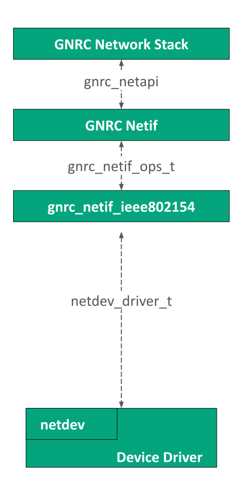
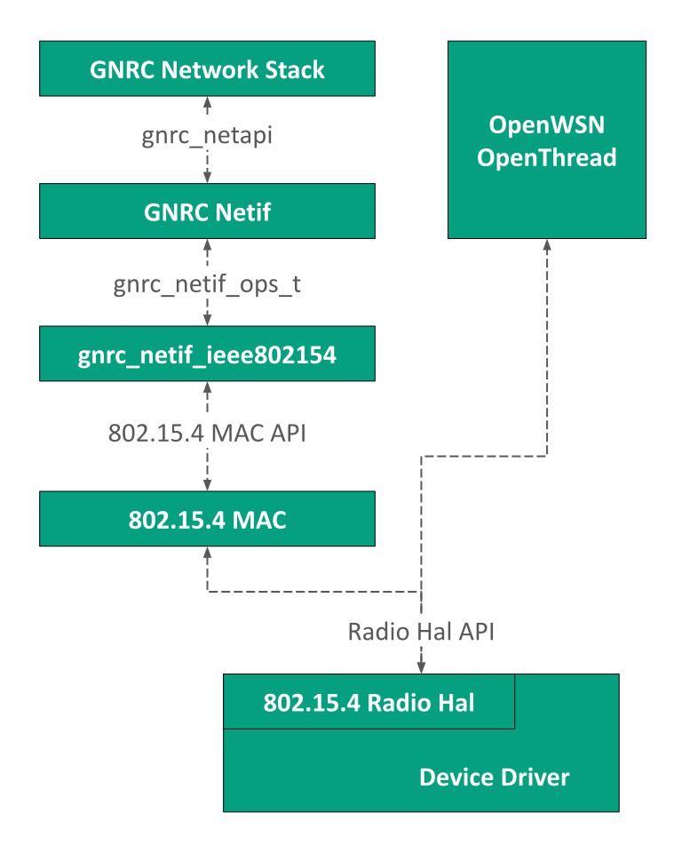
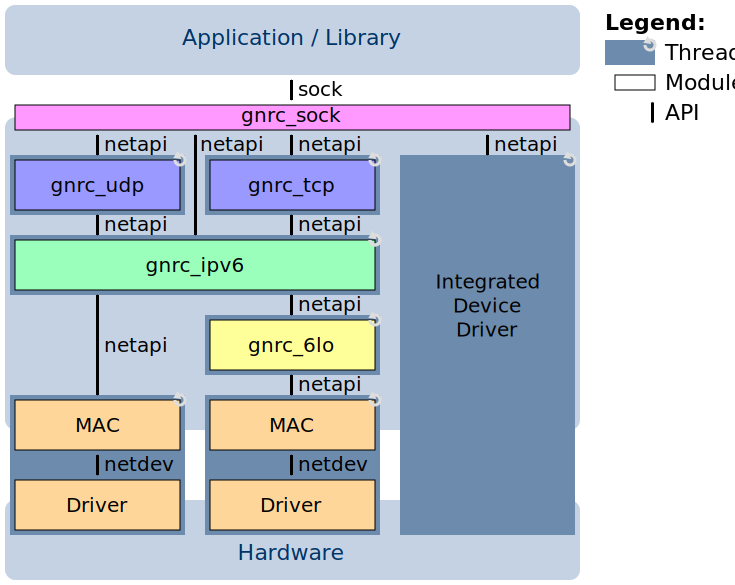
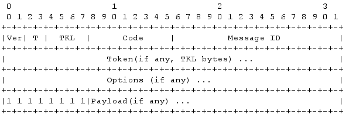
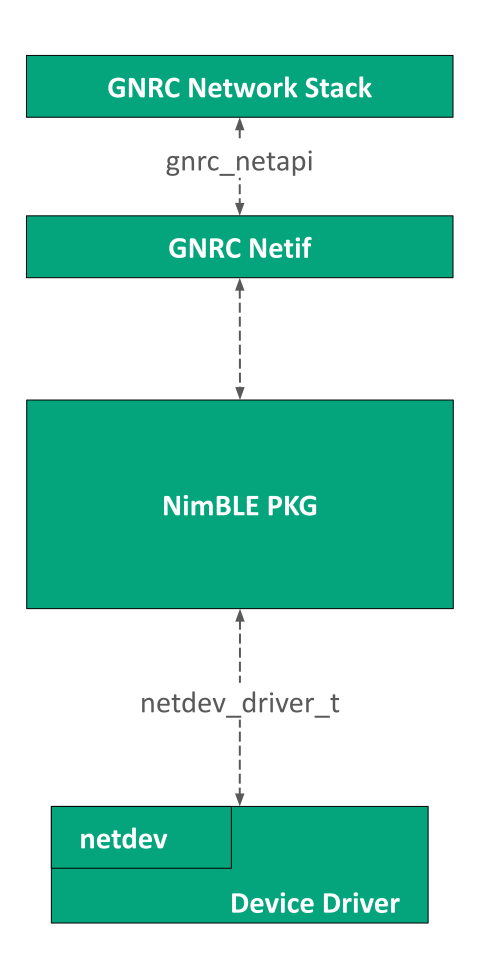

class: center, middle

# Networking in RIOT

---

## IoT in the digital world


.center[
    
]

.right[<span style="font-style: italic;font-size:12px">Source: https://www.keysight.com/upload/cmc_upload/All/Slide_IOT_Part_1.pdf</span>]

---

## Overview of networking technologies for IoT

.center[
    
]

---

## Mapping IoT technologies to OSI layers

.center[
    
    <br><br>
    &#x21d2; RIOT supports ZigBee (6LowPAN), Thread, BLE and WiFi (for esp32/8266)
]

---

## Lots of IoT specifications exist

- **Physical layer**

  &#x21d2; PLC, BACnet, Z-WAze, BLE, IEEE 802.15.4, LoRa, SigFox, IEEE 802.11

- **Network layer** interop with IP networks

  &#x21d2; 6TiSCH, 6LowPAN, RPL, OLSRv2, AODVv2, LoRaWAN

- **Application layer** interop with the Web

  &#x21d2; CoAP, LwM2M, MQTT, CBOR, DTLS, OSCOAP

- **New paradigms**

  &#x21d2; Information centric network (ICN)

.right[
    
]

---

## Networking architecture in RIOT

&#x21d2; designed to integrate any network stack into RIOT

<table>
<tr>
  <td>
    <ul>
      <li>Network layer is decoupled from the hardware via the <b>netdev</b> API or specific HAL API (e.g: ieee802154_hal)<br><br></li>
      <li>Application layer is decoupled from network stack via the <b>sock</b> API<br><br></li>
      <li>Each device driver runs in its <b>own thread</b><br><br></li>
      <li>Radio drivers are implemented in `drivers`<br><br></li>
      <li>Network APIs are defined in `sys/include/net` and implemented in `sys/net`<br><br></li>
    </ul>
  </td>
  <td>
.center[
    
]
  </td>
</tr>
</table>

---

## Available IP stacks

- **GNRC**
  - Generic in-house network stack

- **LwIP**
  - full featured network stack
  - provided as a package in `pkg/lwip`

- **OpenThread**
  - Opensource implementation of the Thread specifications
  - provided as a package in `pkg/openthread`

- **OpenWSN**
  - a deterministic MAC layer implementing the <br/>IEEE 802.15.4e TSCH protocol

---

## Other stacks

- **Bluetooth Low Energy** (BLE) stack
  - based on the [Apache Mynewt NimBLE](https://github.com/apache/mynewt-nimble)
    library

- **Controller Area Network** (CAN) stack
  - Native mode (SocketCAN) + driver for TJA1042 + STM32 peripheral driver

- **LoRaWAN**:
  - based Semtech [Loramac-node](https://github.com/Lora-net/LoRaMac-node)
    reference implementation
  - provided as a package in `pkg/semtech-loramac`

- **UWB (ultra wide band) & TWR (two way ranging)**:
  - based on Decawave [uwb-core](https://github.com/decawave/uwb-core) library

---

## Network device driver API

<table>
<tr>
  <td>
.center[
    
]
<ul>
<li>Radio events trigger interrupts &#x21d2; ISR context</li>

<li>Use threads messaging to manage them nicely<br>
  &#x21d2; move fast from ISR context to netdev thread context</li>

<li>
    <a href="http://doc.riot-os.org/group__drivers__netdev__api.html">
        http://doc.riot-os.org/group__drivers__netdev__api.html
    </a>
</li>
</ul>
  </td>
  <td>
.center[
    
]
  </td>
</tr> </table>

---

## IEEE802154 Hardware Access Layer

<table>
  <td>
  <ul style="width: 300px">
    <li> Hardware Abstraction Layer (HAL) for IEEE802.15.4 radios</li><br></br>
    <li> Allows direct radio access and configuration</li><br></br>
    <li> Allows implementing agnostic PHY and MAC layers on top </li><br></br>
    <li>For more see <a href="https://github.com/RIOT-OS/RIOT/blob/67febcc62bb83d161892915a9bcf4f9c0f4ae2bb/doc/memos/rdm-draft-alamos-ieee802154-radio-hal.md">Radio HAL RDM</a></li>
  </ul>
  </td>
  <td>
.center[
    
]
  </td>
</table>

---

## Exercise: Basic 802.15.4 radio manipulations

Follow the instructions in the notebook **riot/networking/802.15.4.ipynb**

.center[
<form class=notebook>
    <input class=login id="login_802154" type="text" oninput="check_login('login_802154', 'launcher_802154')" placeholder="Enter your IoT-LAB login">
    <input class=launcher id="launcher_802154" type="button" value="Launch notebook" onclick="open_notebook('login_802154', 'riot/networking/802.15.4/802.15.4.ipynb')" disabled>
</form>
]

---

## The GNRC stack of RIOT

.center[
    
]

- Radio drivers are accessed through the **netdev** API (or `ieee802154_hal`)

- All internal components use a single API: **netapi**

- The applications uses the **sock** API

---

## Networking modules

- **GNRC:** All networking modules are loaded with the **gnrc_ipv6_default** module

- **lwIP**:

  - IPv4 networking modules are loaded with **lwip_ipv4**

  - IPv6 networking modules are loaded with **lwip_ipv6**

- Device drivers modules:

  - 802.15.4 drivers: <br>
    &#x21d2; **at86rf2xx**, **cc2420**, **kw2xrf**, **mrf24j40**, **xbee**

  - Ethernet drivers: <br>
    &#x21d2; **enc28j60**, **w5100**, **esp32**, **esp8266**

  - For drivers, use **gnrc_netdev_default** and **auto_init_gnrc_netif**

---

## IPv6 addresses manipulations

- IPv6 manipulation functions are provided by the `ipv6_addr` module

- See: http://doc.riot-os.org/group__net__ipv6__addr.html

- Some useful functions:

```c
/* is loopback (::1) */
static bool ipv6_addr_is_loopback (const ipv6_addr_t *addr);

/* is mulicast (ff02::1, ff02::2, etc) */
static bool ipv6_addr_is_multicast (const ipv6_addr_t *addr);

/* is link local (fe80:x:x:z::/64) */
static bool ipv6_addr_is_link_local (const ipv6_addr_t *addr);

/* is global */
static bool ipv6_addr_is_global (const ipv6_addr_t *addr);

/* convert from string */
ipv6_addr_t * ipv6_addr_from_str (ipv6_addr_t *result, const char *addr);

/* convert to string */
char * ipv6_addr_to_str (char *result, const ipv6_addr_t *addr,
                         uint8_t result_len);
```

---

## Exercise: IPv6 networking

Follow the instructions in the notebook **riot/networking/ipv6/ipv6.ipynb**

.center[
<form class=notebook>
    <input class=login id="login_ipv6" type="text" oninput="check_login('login_ipv6', 'launcher_ipv6')" placeholder="Enter your IoT-LAB login">
    <input class=launcher id="launcher_ipv6" type="button" value="Launch notebook" onclick="open_notebook('login_ipv6', 'riot/networking/ipv6/ipv6.ipynb')" disabled>
</form>
]

---

## The Sock API (1)

- Provides a common abstraction on top of any IP stack

- An application built on top of Sock is portable on any network stack

- Both asynchronous and synchronous access (depending on the implementation)

- 3 kinds of sock types provided:<br><br>
  &#x21d2; **Raw IPv4/IPv6**, **UDP** and **TCP**

- Depending on the stack used, import the right modules:<br><br>
  &#x21d2; with GNRC, modules are **gnrc_sock_ip**, **gnrc_sock_udp**, **gnrc_sock_tcp**

- More information: http://doc.riot-os.org/group__net__sock.html

---

## The Sock API (2)

- 3 different types:

  - **sock_ip_t**, include from `net/sock/ip.h`<br>
    &#x21d2; http://doc.riot-os.org/group__net__sock__ip.html

  - **sock_udp_t**, include from `net/sock/udp.h`<br>
    &#x21d2; http://doc.riot-os.org/group__net__sock__udp.html

  - **sock_tcp_t**, include from `net/sock/tcp.h`<br>
    &#x21d2; http://doc.riot-os.org/group__net__sock__tcp.html

- 4 functions to use (`<type>` can be `ip`, `udp` or `tcp`):

```c
/* Create the sock instance */
int sock_<type>_create(sock_<type>_t *sock, const sock_<type>_ep_t *local,
                       const sock_<type>_ep_t *remote, ...);
/* Send a packet using the sock instance to a remote */
ssize_t sock_<type>_send(sock_<type>_t *sock, const void *data, size_t len, ...,
                         const sock_<type>_ep_t *remote);
/* Wait for incoming packets from a remote */
ssize_t sock_<type>_recv(sock_<type>_t *sock, void *data, size_t max_len,
                         uint32_t timeout, sock_<type>_ep_t *remote);
/* Close the sock instance */
void sock_<type>_close(sock_<type>_t *sock);
```

---

## Exercise: UDP client-server application

Follow the instructions in the notebook **riot/networking/udp-sock/udp-sock.ipynb**

.center[
<form class=notebook>
    <input class=login id="login_sock_udp" type="text" oninput="check_login('login_sock_udp', 'launcher_sock_udp')" placeholder="Enter your IoT-LAB login">
    <input class=launcher id="launcher_sock_udp" type="button" value="Launch notebook" onclick="open_notebook('login_sock_udp', 'riot/networking/udp-sock/udp-sock.ipynb')" disabled>
</form>
]

---

## The Posix Socket API

- Provides a Posix compliant networking API

- Import module **posix_sockets**

- Use
```c
#include <arpa/inet.h>
#include <netinet/in.h>
#include <sys/socket.h>
```

- Functions come from the Posix socket API:
```c
/* Create a socket */
int socket(int socket_family, int socket_type, int protocol);
/* Assign an address to the socket */
int bind(int sockfd, const struct sockaddr *addr, socklen_t addrlen);
/* Wait for incoming packets */
ssize_t recvfrom(int sockfd, void *buf, size_t len, int flags,
                 struct sockaddr *src_addr, socklen_t *addrlen);
/* Send packets */
ssize_t sendto(int sockfd, const void *buf, size_t len, int flags,
               const struct sockaddr *dest_addr, socklen_t addrlen);
```

---

## Exercise: Posix UDP client-server application

Follow the instructions in the notebook **riot/networking/udp/udp.ipynb**

.center[
<form class=notebook>
    <input class=login id="login_udp" type="text" oninput="check_login('login_udp', 'launcher_udp')" placeholder="Enter your IoT-LAB login">
    <input class=launcher id="launcher_udp" type="button" value="Launch notebook" onclick="open_notebook('login_udp', 'riot/networking/udp/udp.ipynb')" disabled>
</form>
]

---

## The CoAP protocol

- CoAP is an HTTP-like designed for very small devices<br>
  &#x21d2; built on top of UDP, standard port is **5683**

- Standard from CORE working group at IETF<br>
  &#x21d2; RFC 7252 https://tools.ietf.org/html/rfc7252<br>
  &#x21d2; RFC 7959 https://tools.ietf.org/html/rfc7959<br>
  &#x21d2; RFC 8323 https://tools.ietf.org/html/rfc8323<br>

- 4 types of requests: `GET`, `POST`, `PUT`, `DELETE`

- `.well-known/core` URI describes the list of URIs on a CoAP server

- Others options: `OBSERVE`, Block-wise transfer

.center[
    
]

---

## CoAP implementations

- Several implementations exists, in multiple languages:<br><br>

  &#x21d2; See http://coap.technology/impls.html

- RIOT provides support for CoAP:

  - Natively with **nanocoap** and **gcoap** modules

  - Via packages with **microcoap**

- **nanocoap**

  - designed to very memory efficient
  - limited features

- **gcoap**

  - provides more features: `OBSERVE`, coap client API
  - less memory efficient

---

## Using the gcoap API to setup a CoAP server (1)

- Include the required header
```c
#include "net/gcoap.h"
```
- Define a list of resources in an array of `coap_resource_t`:
```c
static const coap_resource_t _resources[] = {
        { "/coap/url", COAP_GET | COAP_PUT, _handler, NULL },
}
```
- The handler function signature is:
```c
static ssize_t _handler(coap_pkt_t* pdu, uint8_t *buf,
                            size_t len, void *ctx);
```
- Use other gcoap functions to format the reply:
```c
/* Initialize the reply */
gcoap_resp_init(coap_pkt_t *pdu, uint8_t *buf, size_t len, unsigned code);
/* Send the reply */
ssize_t gcoap_response(coap_pkt_t *pdu, uint8_t *buf,
                           size_t len, unsigned code);
```

---

## Using the gcoap API to setup a CoAP server (2)

- Register your resources in gcoap listener:
```c
static gcoap_listener_t _listener = {
    &_resources[0],
    sizeof(_resources) / sizeof(_resources[0]),
    NULL
};
```
- Finally, start the gcoap listener:
```c
gcoap_register_listener(&_listener);
```

- Find more details at http://doc.riot-os.org/group__net__gcoap.html

---

## Exercise: complete CoAP application

Follow the instructions in the notebook **riot/networking/coap/coap.ipynb**

.center[
<form class=notebook>
    <input class=login id="login_coap" type="text" oninput="check_login('login_coap', 'launcher_coap')" placeholder="Enter your IoT-LAB login">
    <input class=launcher id="launcher_coap" type="button" value="Launch notebook" onclick="open_notebook('login_coap', 'riot/networking/coap/coap.ipynb')" disabled>
</form>
]

---

## Bonus: NimBLE BLE


<table>
  <td><br></br>
<b>NimBLE:</b> Open-source Bluetooth 5.1 stack (both Host & Controller) for Nordic chipsets.
  <ul>
  <b>Features highlight:</b><br></br>
    <li> Support for 251 byte packets</li><br>
    <li> Support for all 4 roles concurrently - Broadcaster, Observer, Peripheral and Central</li><br>
    <li> Support for up to 32 simultaneous connections</li><br>
    <li> Bluetooth Mesh</li><br>
    <li> Advertising Extensions</li><br>
    <li> Low Level API Access</li><br>
  </ul>
  </td>
  <td>
.center[
    
]
  </td>
</table>


---

## Exercise: BLE Nimble scan-advertise

Follow the instructions in the notebook **riot/ble/ble_scan/ble_scan.ipynb**

.center[
<form class=notebook>
    <input class=login id="login_ble" type="text" oninput="check_login('login_ble', 'launcher_ble')" placeholder="Enter your IoT-LAB login">
    <input class=launcher id="launcher_ble" type="button" value="Launch notebook" onclick="open_notebook('login_ble', 'riot/ble/ble_scan/ble_scan.ipynb')" disabled>
</form>
]

---

class: center, middle

[Back to the course](https://github.com/riot-os/riot-course#content-of-the-course)
