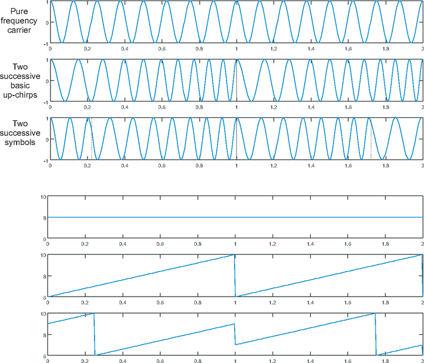
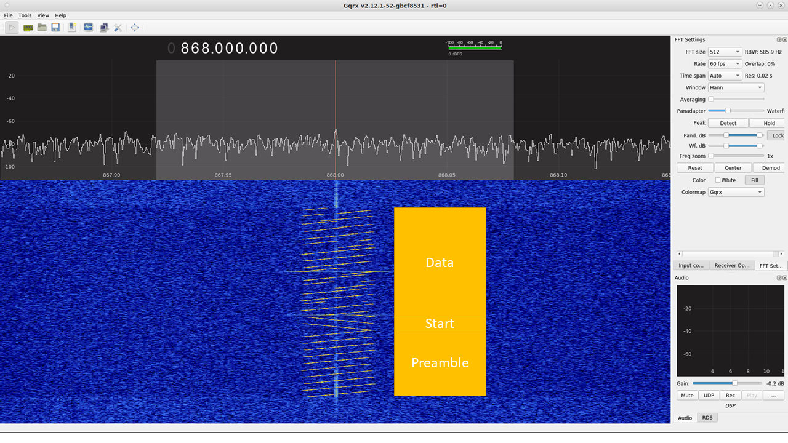

class: center, middle

# LoRaWAN with RIOT

---

## IoT protocols

.center[
  iser  
]

---

## Overview of LoRaWAN

 

- Designed by Semtech and promoted by the LoRa Alliance

 
.center[
    
    
]

 

- First release 1.0 of the LoRaWaN specification in 2015

- Latest release 1.1 in 2018

- Based on long range radio communication modulation, LoRa

- Star network topology &#x21d2; devices talks to the network via gateways

---

## A few words on LoRa

<table style="width:100%;margin-top:-40px">
<tr>
  <td>
  <ul>
  <li>Long range radio technology  </li>
  <li>Very robust to noise, multipath and Doppler effect</li>
  <li>Spread Spectrum modulation:   &#x21d2; "Chirp Spread Spectrum"  </li>
  <li>The binary data is coded by shifting the symbol  </li>
  <li>Bandwidth can be 125, 250 or even 500kHz</li>
  </ul>
  </td>
  <td>.center[
      
    ]
</tr>
</table>
.center[
  
]

---

## The spreading factor

* Spreading factor (SF) = duration of a chirp &#x21d2; increase SF by 1 = duration x 2

* SF7 reprensents 7 bits in 1 symbol

* Signals using different SF don't interfere &#x21d2; they are orthogonal

* In short, raising the spreading factor:
    * increases the range (up to several kilometers)
    * reduce the throughput
    * increase the time on air
    * increases energy consumption

.center[
  
  
]

---

## The LoRaWAN protocol

.center[ ]

 

- Different frequency bands depending on the geographical regions

- Use LoRa modulation

- 3 device classes &#x21d2; A, B & C

- The application layer is directly on top of the MAC layer

---

## Access to the physical layer

.center[
    
]

 

- Public and free **ISM bands** used: EU868 (ETSI), US915, etc

- Bands are divided into **channels** of 3 different widths: 125kHz, 250kHz ou 500kHz

- Time constrained access to the physical layer &#x21d2; **Duty Cycle** (1% / channel)

- Example: at least 16 channels can be used in EU868 band

---

## Time On Air

Dependent on several factors: payload, bandwidth, spreading factor, etc.

Calculating the TOA:
- [TTN Airtime Calculator](https://www.thethingsnetwork.org/airtime-calculator)
- [LoRa Airtime Calculator spreadsheet](https://docs.google.com/spreadsheets/d/1voGAtQAjC1qBmaVuP1ApNKs1ekgUjavHuVQIXyYSvNc/edit#gid=0)
- [lorawan_toa package](https://github.com/tanupoo/lorawan_toa)

---

## Class A & C devices

<table style="width:100%">
<tr>
  <td><b>Class A device</b>
  <ul>
  <li>Can only receive after a send</li>
  <li>Smallest power consumption</li>
  <li>Can be used on battery</li>
  </ul>
  
  </td>
  <td> 
  .center[ 
Power consumption of a class A device]</td>
</tr>
</table>

<table style="width:100%">
<tr>
  <td><b>Class C device</b>
  <ul>
  <li>Always listening: low latency</li>
  <li>More power consumption</li>
  <li>Cannot be used on battery</li>
  </ul>
  </td>
  <td> </td>
</tr>
<table>

---

## LoRaWAN network architecture

.center[
     
]

- **Devices and gateways** exchange messages using LoRa communications

- **Gateway** are connected to the network server via regular Internet protocols

- Users access their data via an application connected to the network server

- Security of the data is garantueed by **AES** encryption (symmetric keys)

---

## Device communication on the network

.center[
     
]

 

- Every device is identified by a 4 bytes address

- "Network session key" &#x21d2; used to encrypt the network related data (MAC)

- "Application session key" &#x21d2; used to encrypt the application related data

---

## Activation procedures

.center[To exchange data, all devices must be activated by the network]

&#x21d2; 2 type of activation procedures:

- Over-The-Air Activation(OTAA)

.center[
     
]

- Activation By Personnalization (ABP): 
  &#x21d2; No handshake, only requires APPSKEY, NWKSKEY and DEVADDR

---

## Network operators

Some LoRaWAN operators:

- Orange https://www.orange-business.com/en/products/iot-connect-anywhere

- Actility https://www.actility.com/

- Orbiwise  https://www.orbiwise.com/

- TheThingsNetwork https://www.thethingsnetwork.org/

.center[
     
]

---

## TheThingsNetwork (TTN)

- The network deployment is **community based**

- Software stack is open-source

.center[
     
]

- Unlimited access to the backend

  - no device limit

  - no strong message limit (with respect to the duty-cycle)

  - friendly API (MQTT)

---

## Test TTN with RIOT: practice

Follow the instructions in the notebook **riot/lorawan/ttn-getting-started/ttn-getting-started.ipynb**

.center[
<form class=notebook>
    <input class=login id="login_ttn_getting_started" type="text" oninput="check_login('login_ttn_getting_started', 'launcher_ttn_getting_started')" placeholder="Enter your IoT-LAB login">
    <input class=launcher id="launcher_ttn_getting_started" type="button" value="Launch notebook" onclick="open_notebook('login_ttn_getting_started', 'riot/lorawan/ttn-getting-started/ttn-getting-started.ipynb')" disabled>
</form>
]

---

## Exercise: Send sensor data to TTN

Follow the instructions in the notebook **riot/lorawan/ttn-sensors/ttn-sensors.ipynb**

.center[
<form class=notebook>
    <input class=login id="login_ttn_sensors" type="text" oninput="check_login('login_ttn_sensors', 'launcher_ttn_sensors')" placeholder="Enter your IoT-LAB login">
    <input class=launcher id="launcher_ttn_sensors" type="button" value="Launch notebook" onclick="open_notebook('login_ttn_sensors', 'riot/lorawan/ttn-sensors/ttn-sensors.ipynb')" disabled>
</form>
]

---

## Integration with external services

- Use of TTN http and/or MQTT API to retrieve the IoT data

- Super simple to integrate

- Available services:

  - Customizable dashboards with Cayenne 
    https://mydevices.com/

  - Location service with Collos 
    http://preview.collos.org/

  - Gather and analyze workspace use and sensors with OpenSensors 
    https://opensensors.com/

  - Just store your IoT data with TheThingsIndustries 
    https://www.thethingsindustries.com/

---

## The TTN MQTT API

- MQTT protocol uses a publish/subscribe approach
.center[
     
]

- TTN MQTT API documentation 
https://www.thethingsnetwork.org/docs/applications/mqtt/

- Reference implementation provided by the Eclipse Mosquitto project 
https://mosquitto.org/

- Eclipse also provides a python library: _paho_ 
https://www.eclipse.org/paho/

---

## Exercise: Downlink from a LoRaWAN network

Follow the instructions in the notebook **riot/lorawan/ttn-mqtt/ttn-mqtt.ipynb**

.center[
<form class=notebook>
    <input class=login id="login_ttn_mqtt" type="text" oninput="check_login('login_ttn_mqtt', 'launcher_ttn_mqtt')" placeholder="Enter your IoT-LAB login">
    <input class=launcher id="launcher_ttn_mqtt" type="button" value="Launch notebook" onclick="open_notebook('login_ttn_mqtt', 'riot/lorawan/ttn-mqtt/ttn-mqtt.ipynb')" disabled>
</form>
]

---

## An example: Cayenne

https://mydevices.com/cayenne/docs/lora/#lora-the-things-network

- Create only dashboards in a few clicks from your LoRaWAN data

- Access your sensor data from anywhere

- Payload format requirement: Low Power Payload (LPP)

  - Library available for python/micropython: 
  https://github.com/jojo-/py-cayenne-lpp

  - Library available for Arduino (C++): 
  https://github.com/sabas1080/CayenneLPP

  - Generic library in C 
  https://github.com/aabadie/cayenne-lpp

---

## Exercise: Integration with Cayenne LPP

Follow the instructions in the notebook **riot/lorawan/ttn-cayenne-lpp/ttn-cayenne-lpp.ipynb**

.center[
<form class=notebook>
    <input class=login id="login_ttn_cayenne_lpp" type="text" oninput="check_login('login_ttn_cayenne_lpp', 'launcher_ttn_cayenne_lpp')" placeholder="Enter your IoT-LAB login">
    <input class=launcher id="launcher_ttn_cayenne_lpp" type="button" value="Launch notebook" onclick="open_notebook('login_ttn_cayenne_lpp', 'riot/lorawan/ttn-cayenne-lpp/ttn-cayenne-lpp.ipynb')" disabled>
</form>
]

---

class: center, middle

# The End

[Back to the course](https://github.com/riot-os/riot-course#content-of-the-course)
