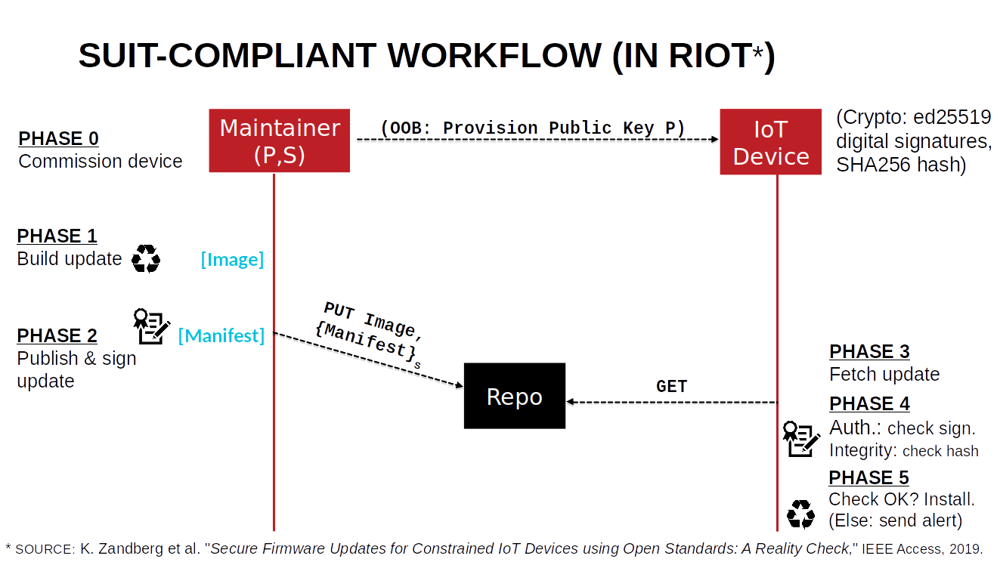

class: center, middle

# IoT Security with RIOT

## IoT Security Basics with Microcontrollers

<a href=https://github.com/riot-os/riot-course>https://github.com/riot-os/riot-course</a>

---

## What Attacks?

To secure IoT devices, one must consider attacks of diverse nature.

.center[
    
]

---

## What's special about IoT Security?

Mechanisms must:

- require 10^6 less (RAM and Flash) memory;

- require 10^6 less (control and user) traffic throughput;

- support much smaller packet size (very efficiently);

- function with much weaker CPU, 10^3 slower or less;

- human factor is different (not 1:1 relationship for humans / machines);

- secure storage of secrets (e.g. cryptographic keys) is a challenge on
simplistic low-end IoT device.

---

## Security in Practice

IoT security in practice must combine

- several defense mechanisms,
- working at different levels of the system, and
- protecting against different types of attacks.

Each of these defense mechanisms is necessary, but not sufficient to achieve security overall.
  

Next, we focus on mechanisms applicable on low-end IoT devices to:

- defend against network attacks, and
- defend against some software attacks based on remote malware installation.

---

## Crypto Primitives for IoT Security (1)

Appropriate primitives for basic guarantees on digital data in IoT?

- **Authenticity**: guarantee on the origin of the data;

- **Integrity**: guarantee that original data has not been tampered with;

- **Confidentiality**: guarantee that data is intelligible only for intended recipients.

---

## Crypto Primitives for IoT Security (2)

Typical building blocks are:

- **Hash**: function mapping data of arbitrary size to (smaller) fixed-size values;

- **Encryption**: set of algorithms enabling the originator (resp. recipient) of digital data to encode (resp. decypher) this data using one or more keys.

- **Digital Signature**: set of algorithms enabling (private/public) key generation, signature generation based on private key and authenticity verification based on public key.

---

## Exercise: Compute a Hash with SHA-256 and SHA3-256

- Some configurations of SHA-3 and SHA-2 are typically used on low-power IoT devices.

- Follow the instructions in the notebook **riot/security/hash/hash.ipynb**

.center[
<form class=notebook>
    <input class=login id="login_hash" type="text" oninput="check_login('login_hash', 'launcher_hash')" placeholder="Enter your IoT-LAB login">
    <input class=launcher id="launcher_hash" type="button" value="Launch notebook" onclick="open_notebook('login_hash', 'riot/security/hash/hash.ipynb')" disabled>
</form>
]

  
.center[
    
]

---

## Exercise: Sign / Verify a Digital Signature with ed25519

- Elliptic Curve Crypto is preferred on low-end IoT devices.

- A popular solution here is the Edwards curve Digital Signature Algorithm (EdDSA), a variant of the
Schnorr signature scheme, on the ed25519 curve.

- Follow the instructions in the notebook **riot/security/signature/signature.ipynb**

.center[
<form class=notebook>
    <input class=login id="login_signature" type="text" oninput="check_login('login_signature', 'launcher_signature')" placeholder="Enter your IoT-LAB login">
    <input class=launcher id="launcher_signature" type="button" value="Launch notebook" onclick="open_notebook('login_signature', 'riot/security/signature/signature.ipynb')" disabled>
</form>
]

.center[
    
]

---

## Exercise: Encrypt / Decrypt a Message using AES128 (CTR Mode)

- AES is a popular solution for symmetric cryptography on low-end IoT devices.

- Follow the instructions in the notebook **riot/security/encryption/encryption.ipynb**

.center[
<form class=notebook>
    <input class=login id="login_encrypt" type="text" oninput="check_login('login_encrypt', 'launcher_encrypt')" placeholder="Enter your IoT-LAB login">
    <input class=launcher id="launcher_encrypt" type="button" value="Launch notebook" onclick="open_notebook('login_encrypt', 'riot/security/encryption/encryption.ipynb')" disabled>
</form>
]

  
.center[
    
]

---

## Network Protocols for IoT Security (1)

Generic protocols for low-power IoT networks?

- wide variety low-power comunication technologies (BLE, Zigbee, LoRa, SigFox... and some wired alternatives too)
- IP protocols have been adapted to work over these

.center[
    
]

---

## Network Protocols for IoT Security (2)

Generic security protocols for low-power IoT networks?

.center[
    
]
---

## Exercise: Secure Communication using DTLS over IPv6 and 6LoWPAN

- DTLS (Datagram Transport Layer Security) is a protocol standardized by the Internet
Engineering Task Force (IETF) which secures communications over UDP.

- DTLS guarantees the integrity, authenticity and confidentiality of the data flowing through
the secure channel it establishes from A to B, over UDP.

- Follow the instructions in the notebook **riot/security/dtls/dtls.ipynb**

.center[
<form class=notebook>
    <input class=login id="login_dtls" type="text" oninput="check_login('login_dtls', 'launcher_dtls')" placeholder="Enter your IoT-LAB login">
    <input class=launcher id="launcher_dtls" type="button" value="Launch notebook" onclick="open_notebook('login_dtls', 'riot/security/dtls/dtls.ipynb')" disabled>
</form>
]

---

## Securing IoT Software (1)

What Internet-age software has taught us:

- you can’t secure what you can’t update!
- software updates are an attack vector!

=> **Enabling (legitimate) software updates is crucial and difficult**

---

## Securing IoT Software (2)

SUIT standard (work-in progress at IETF, see draft-ietf-suit-manifest-09)

.center[
    
]

---
## SUIT Workflow

.center[
    
]

---

## Exercise: Secure IoT Firmware Update using SUIT and CoAP

- This exercise combines building blocks from the previous exercises! Hashing, signature, low-power network protocol stack, and SUIT-compliant RIOT firmware update security.

- Follow the instructions in the notebook **riot/security/ota/ota.ipynb**

.center[
<form class=notebook>
    <input class=login id="login_ota" type="text" oninput="check_login('login_ota', 'launcher_ota')" placeholder="Enter your IoT-LAB login">
    <input class=launcher id="launcher_ota" type="button" value="Launch notebook" onclick="open_notebook('login_ota', 'riot/security/ota/ota.ipynb')" disabled>
</form>
]

---

class: center, middle

[Back to the course](https://github.com/riot-os/riot-course#content-of-the-course)

 
 
.center[

]
