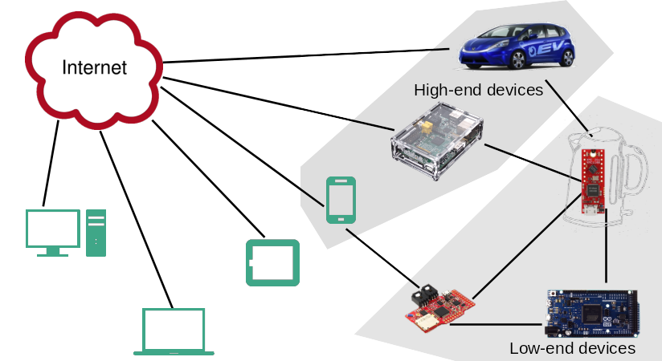
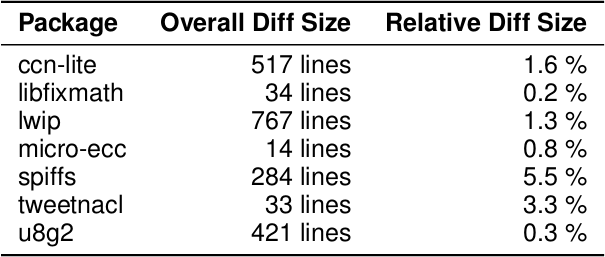
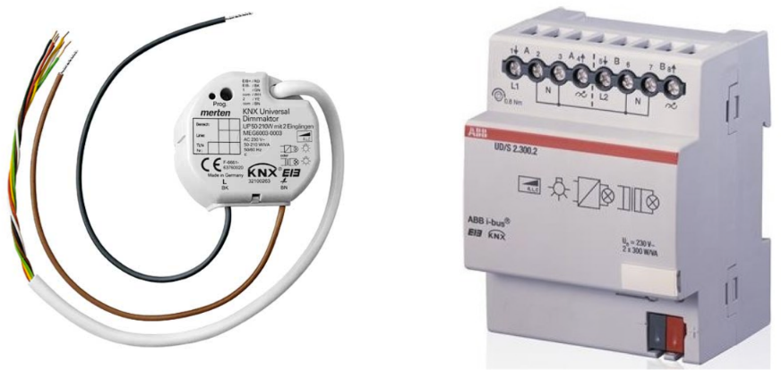

class: center, middle

   

## An OS for Open Source IoT

### MtoM - Embedded Systems

 

.right[.footer[
Alexandre Abadie 
Ingénieur de Recherche Inria 
Contributeur RIOT 
Team FIT/IoT-LAB]]

---

## What is RIOT

- **operating system** for microcontrollers

 - **microkernel architecture** &#x21d2; require very low resources
 - **real-time** and **multi-threaded**
 - comes with **in-house networking stacks**

--

 

- **open-source**: <a href="https://github.com/RIOT-OS/RIOT">https://github.com/RIOT-OS/RIOT</a>

 - free software platform
 - **world-wide community** of developers

--

 

- **easy to use** and __reuse__

 - Standard programming in C
 - Standard tooling
 - **API is independent** from the hardware

---

## RIOT in the IoT world

.center[
  
  
**&#x21d2; RIOT is designed for low-end devices (kB RAM, MHz, mW)**
]

---

## History of the project

- 2013: Inria, FU Berlin and HAW founded RIOT
 - stemed from a French-German research project
 - kernel evolved from FireKernel

--

- The community today:

  - So far, 200 different contributors to the master branch
  - Academics: Berkeley, UCLA, MIT, AIT, TZI, etc
  - Industrial: Cisco, Samsung, ImgTec, Fujitsu, Thalès
  - SME: Zolertia, OTAKeys, Mesotic, Eistec, We-sens

--

- Annual RIOT Summit: https://summit.riot-os.org

---

## Competitors

.center[
    
]

Reference: O. Hahm et al. "Operating Systems for Low-End Devices 
in the Internet of Things: A survey," IEEE Internet of ThingsJournal, 2016.

 
 

 - requires less memory & adapts to a wider range of architectures

 - fosters an open-source philosophy more akin to Linux

 - provides more complete and stable OS functionalities

---

## The RIOT philosophy & community

- RIOT is free-software, licensed under LGPLv2.1

- The community takes inspiration from Linux

--

- Use standards whenever possible  
  (C-ANSI, standard tools, standard protocols, standard procedures)

- Follow POSIX standards

--

- Avoid code duplication, easy to program, increase portability, modularity

- Vendor & Technology independence

--

- Decisions and orientations are taken by a grass-root community

.center[
    
]

---

## Ecosystem & community processes

- Tooling and build system

  &#x21d2; **hand crafted makefiles** for building a RIOT application  
  &#x21d2; On-Chip debugging with **OpenOCD** and **GDB** 

--

- Distributed and fast CI, Murdock: https://ci.riot-os.org

    &#x21d2; **Build and run** all test/example applications  
    &#x21d2; **Static tests** (Cppcheck, Coccinelle, etc) 

--

- **Online documentation** generated with Doxygen

    &#x21d2; https://doc.riot-os.org

--

- In-depth **code reviews**

- Stable **release every 3 months**: &lt;year&gt;.&lt;month&gt; (ex: 2018.07, 2018.10, etc)

---

class: center, middle

# Technical overview

 
Long story short: paper in IEEE Internet of Things Journal 
Preprint available: http://riot-os.org/files/2018-IEEE-IoT-Journal-RIOT-Paper.pdf

---

## OS characteristics

- Micro-kernel based architecture: modular approach

--

- Small footprint &#x21d2; 2.8kB RAM, 3.2kB ROM on 32-bit Cortex-M

--

- Real-Time scheduler
  - &#x21d2; fixed priorities preemption with O(1) operations
  - &#x21d2; tickless scheduler

--

- Multi-Threading and IPC:
  - Separate thread contexts with separate thread memory stack
  - Minimal thread control block (TCB)
  - Thread synchronization using mutexes, semaphores and messaging

---

## Hardware support overview

- **Hardware abstraction layer:** support for 8/16/32 bit, ARM, AVR, MIPS

- Supported vendors: Microchip, NXP, STMicroelectronics, Nordic, TI, ESP, etc

- **Large list of sensors and actuators** supported (e.g drivers)

- _native_ board: **run RIOT as process on your computer**

- **+100 boards supported**

.center[
    
]

---

## A modular OS

Features are provided as modules &#x21d2; **only build what's required**

- System libraries: **xtimer**, **shell**, crypto, etc

--

- Sensors and actuators

- Display drivers, filesystems, etc

--

- Embedded interpretors: Javascript, LUA

--

- High-level network protocols: CoAP, MQTT-SN, etc

--

- External packages

---

## Network stacks

**IP oriented stacks** &#x21d2; designed for Ethernet, WiFi, 802.15.4 networks

- **GNRC**: the in-house 802.15.4/6LowPAN/IPv6 stack of RIOT

--

- **Thread**: 802.15.4 IPv6 stack provided by the ThreadGroup

--

- **OpenWSN** (experimental): a deterministic MAC layer implementing the  IEEE 802.15.4e TSCH protocol

--

- Other IPv6 stacks:

 - **lwIP**: full-featured network stack designed for low memory consumption

 - **emb6**: A fork of Contiki network stack that can be used without proto-threads

---

## Other network support

- In-house Controller Area Network (**CAN**)
  

--

- **BLE** stack support: <a href="https://github.com/apache/mynewt-nimble">NimBLE</a>

  

--

- **LoRaWAN** stack: port of <a href="">Semtech loramac-node</a> reference implementation 
&#x21d2; Compliant with LoRaWAN 1.0.2, considered stable

  

--

- **SigFox** support for ATA8520e modules

---

## Coming soon

- NB-IoT support

--

- Full features USB stack

--

- Standard and secure software update implementation

--

- And many other cool things !

---

class: center, middle

# RIOT in action

---

## IoT deployments using RIOT

.center[
    **Telefonica Chile: LoRa devices in a mine**  
     
    <a href="http://riot-os.org/files/RIOT-Summit-2017-slides/6-2-Network-Session-DropWatcher.pdf">More information</a>
]

---

## IoT deployments using RIOT

.center[
**Almagro: Automatic cereal dispenser**  
 
<a href="https://www.indiegogo.com/projects/the-venture-algramo-chile#/">More information</a>
]

---

## IoT deployments using RIOT

.center[
**Home automation using KNX**  
 

  
<a href="http://summit.riot-os.org/2018/wp-content/uploads/sites/10/2018/09/2_2-Bas-Stottelaar-KNX.pdf">More information</a>
]

---

## IoT products & services using RIOT

- Environment monitoring: Hamilton IoT (USA), Unwired Devices (Russia)

.center[
    
    
]

- On-Board diagnostics for connected cars: OTAKeys (Continental)

- Design Office: Eistec (Sweeden), Mesotic (France)

---

## RIOT on FIT/IoT-LAB large scale testbed

.center[<a href=https://www.iot-lab.info>https://www.iot-lab.info</a>  
IoT-LAB is a **large scale experimentation testbed**]

  - Can be used for **testing wireless communication** networks on **small devices**

  - Can be used for **learning** IoT programming and **communication protocols**

  - Can be used for testing software platforms on **heterogeneous hardware**

.center[
      &nbsp;
      
  ]

---

## RIOT online demo

.center[<a href="http://riot-demo.inria.fr">http://riot-demo.inria.fr</a>]

<iframe src="http://riot-demo.inria.fr">

</iframe>

---

## Stay tuned!

.center[

https://twitter.com/riot_os

https://github.com/RIOT-OS/RIOT

 

https://riot-os.org

]