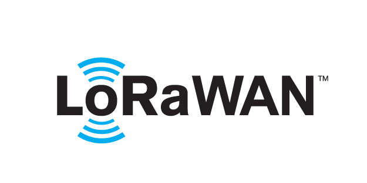
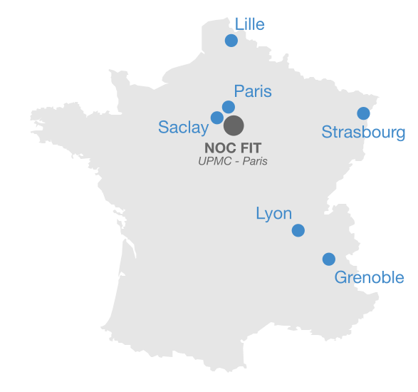

class: center, middle

# RIOT Crash Course

## SPARTA

<a href=https://github.com/riot-os/riot-course>https://github.com/riot-os/riot-course</a>

---

## Crash Course Objectives

1. Get a general overview of RIOT

2. Learn how to write and build a RIOT application

3. Use IoT-LAB for testing a RIOT application remotely on real hardware

<br><br>

.center[
    
]

---

## What is RIOT


- **operating system** for microcontrollers

 - **microkernel architecture** &#x21d2; require very low resources
 - **real-time** and **multi-threaded**
 - comes with **in-house networking stacks**
<br><br>

- **open-source**: <a href="https://github.com/RIOT-OS/RIOT">https://github.com/RIOT-OS/RIOT</a>

 - free software platform
 - **world-wide community** of developers


<br>

- **easy to use** and __reuse__

 - Standard programming in C
 - Standard tooling
 - **API is independent** from the hardware


<br><br>

---

## Large Open-Source Community


- **2013**: started as French-German research project
<br><br>

- 2019: more than **230 contributors** worldwide
  - ~ 25,000 commits and ~ 12,000 Pull Requests
  - Academics, makers, industry <br /> (SME & bigger companies)
  - Hundreds of related scientific publications
  - Products shipping with RIOT in US, Europe,<br />Russia
<br><br>

- Yearly **RIOT Summit** conferences (summit.riot-os.org)
  - Summit’19 was in Helsinki Sept. 5-6


---

## General-Purpose OS for IoT (1)

- **Modularity around a micro-kernel** – building blocks, to be combined in all thinkable ways; Caters for versatile use cases & memory constraints

- **Unified APIs** – across all hardware, even for hardware-accessing APIs; Enables code reuse and minimizes code duplication

- **Vendor & techno. independence** – Vendor libraries: avoided; Design decisions don’t tie RIOT to a particular technology

.center[
    
]

---

## General-Purpose OS for IoT (2)

- **Real-Time** scheduler
  - &#x21d2; fixed priorities preemption with O(1) operations
  - &#x21d2; tickless scheduler, i.e. no periodic timer event
<br><br>

- **Multi-Threading** and IPC:
  - Separate thread contexts with separate <br>thread memory stack
  - Minimal thread control block (TCB)
  - Thread synchronization using mutexes, <br>semaphores and messaging
  - ISR context handles external events<br>and notifies threads using IPC messages
  <br><br>
  - _Note:_ optional multi-threading


---

## A modular OS

Features are provided as modules &#x21d2; **only build what's required**

- System libraries: **xtimer**, **shell**, crypto, etc

- Sensors and actuators

- Display drivers, filesystems, etc

- Embedded interpretors: Javascript, LUA, uPython

- High-level network protocols: CoAP, MQTT-SN, etc

- External packages: lwIP, Openthread, u8g2, loramac, etc

.center[

]

---

## Network stacks

**IP oriented stacks** &#x21d2; designed for Ethernet, WiFi, 802.15.4 networks

- **GNRC**: the in-house 802.15.4/6LowPAN/IPv6 stack of RIOT


- **Thread**: 802.15.4 IPv6 stack provided by the ThreadGroup

.center[
    
]

- Other IPv6 stacks:

 - **lwIP**: full-featured network stack designed for low memory consumption

 - **emb6**: A fork of Contiki network stack that can be used without proto-threads

- IPv6 over **BLE**, <a href="https://github.com/apache/mynewt-nimble">NimBLE</a> stack support

.center[
    
]

---

## Other network support

<br>

- In-house Controller Area Network (**CAN**)

<br><br>

- **LoRaWAN** stack
&#x21d2; Compliant with LoRaWAN 1.0.2

<br><br>


- **SigFox** support for ATA8520e modules

<br><br>


- Full featured **USB** stack (CDC-ACM, CDC-ECM, etc)


<br>


- **SUIT** Standard and secure software update implementation


<br>

---

## Tutorial overview

- Follow the RIOT course on github:
  <a href=https://github.com/riot-os/riot-course>https://github.com/riot-os/riot-course</a>

- Use the preconfigured VM for building applications

- Run the RIOT applications on [IoT-LAB](https://www.iot-lab.info) testbed

- Hardware used:

  - [ST B-L072Z-LRWAN1](https://www.st.com/en/evaluation-tools/b-l072z-lrwan1.html): STM32L0 + LoRa radio

  .center[
      
  ]

  - [ST X-NUCLEO-IKS01A2](https://www.st.com/en/ecosystems/x-nucleo-iks01a2.html): extension shield with sensors

  .center[
      
  ]

---

## About the VM

- Compatible with VirtualBox 5.2 or VMWare Player

--

- Download it from [here](http://demo-fit.saclay.inria.fr/vms/RIOT-VM.ova)
  and import it in VirtualBox/VMWare. Then start it.

--

- The full RIOT course is located in **~/riot-course**

  - A local clone of RIOT is in **~/riot-course/RIOT**

  - Exercices are located in **~/riot-course/exercises**

  - **Important:** Update the local copy of this tutorial:
  ```
  $ cd ~/riot-course
  $ git pull --recurse-submodules
  ```

--

- All required development tools are already installed:

  - The GNU ARM Embedded 7.3 toolchain is installed

  - The IoT-LAB [cli-tools](https://github.com/iot-lab/cli-tools) are installed

  - A list of common editors: Vim, Emacs, VSCode

---

## About IoT-LAB

.center[<a href=https://www.iot-lab.info>https://www.iot-lab.info</a><br><br>
IoT-LAB is a large scale experimentation testbed]

  - Can be used for testing wireless communication networks on small devices

  - Can be used for learning IoT programming and communication protocols

  - Can be used for testing software platforms

.center[
      &nbsp;
      
  ]

---

## IoT-LAB in short

- **2071** programmable nodes, 4 architectures
  <br> &#x21d2; Cortex-M, MSP430, Cortex-A8, AVR

--

- Heterogeneous platforms
  <br> &#x21d2; iotlab-m3, iotlab-a8, Atmel SAMR21-Xpro, Arduino Zero,
  ST B-L072Z-LRWAN1, Zolertia Firefly, nRF52DK, nRF52840DK, Pycom (Micropython)

--

- Heterogeneous radios &#x21d2; 802.15.4, 802.15.4g, LoRa, BLE

--

- IoT-LAB principle

.center[
      
  ]

--

- Start learning IoT with IoT-LAB at
  <a href=https://www.iot-lab.info/tutorials/>https://www.iot-lab.info/tutorials/</a>

---

## Setup your IoT-LAB access in the VM (1)

1. Start the VM and open a command window

2. Select and account from the pad (user is sparta*X*)

3. Register your IoT-LAB credentials
   ```sh
   $ iotlab-auth -u spartaX
   ```
4. Start an experiment with one ST node on Saclay site:
   ```sh
   $ iotlab-experiment submit -n sparta -d 120 \
                               -l 1,archi=st-lrwan1:sx1276+site=saclay
   Using custom api_url: https://www.iot-lab.info/rest/
   {
      "id": 133XXX
   }
   ```
   The experiment will book one node during 120 minutes on Saclay site

5. Wait for the experiment to be in "Running" state:
  ```sh
  $ iotlab-experiment wait -i 133XXX
  "Running"
  ```
---

## Setup your IoT-LAB access in the VM (2)

- Check the name of the iotlab node associated to the experiment:
  ```sh
  $ iotlab-experiment get -i 133XXX -r
  {
      "items": [
          {
              "archi": "st-lrwan1:sx1276",
              "mobile": "0",
              "mobility_type": " ",
              "network_address": "st-lrwan1-10.saclay.iot-lab.info",
              "site": "saclay",
              "state": "Alive",
              "uid": " ",
              "x": "5",
              "y": "67.3",
              "z": "4"
          }
      ]
  }
  ```

&#x21d2; in this case, **st-lrwan1-10.saclay.iot-lab.info** is the node that
was selected by the IoT-LAB booking system.

.center[**Remember yours, you will use it during the tutorial**]

---

## Let's get started

<br><br><br><br><br>

###.center[Follow the [getting-started](https://riot-os.github.io/riot-course/slides/02-getting-started) instructions]
