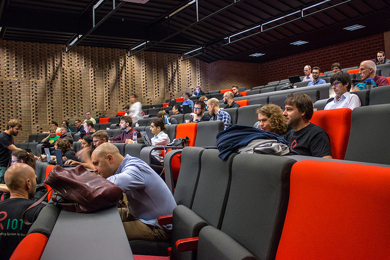
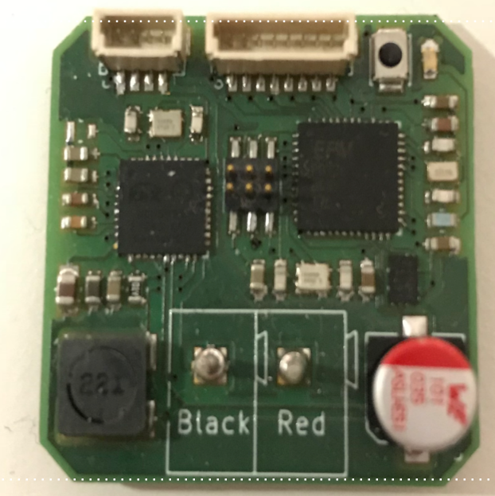

class: center, middle

<br><br><br>

## Microcontroller based IoT

# A hand-on tutorial with RIOT

### Inria Academy

.center[

<br>
[https://riot-os.github.io/riot-course/slides/tutorial-inria-academy-osxp](https://riot-os.github.io/riot-course/slides/tutorial-inria-academy-osxp)
]
<br>
.right[.footer[
  Alexandre Abadie - alexandre.abadie@inria.fr
]]

---

## What is RIOT?

- An **operating system** for microcontroller-based IoT devices

 - **microkernel architecture** &#x21d2; require very low resources
 - **real-time** and **multi-threaded**
 - comes with **in-house networking stacks**

<br>

- An **open-source platform & ecosystem**: <a href="https://github.com/RIOT-OS/RIOT">https://github.com/RIOT-OS/RIOT</a>

 - free software platform
 - **easy to use** and __reuse__
 - Standard programming in C, standard tooling
 - **API is independent** from the hardware

<br>

- A **world-wide community** of developers

 - lively exchanges on <a href="https://forum.riot-os.org/">Forum</a>, <a href="https://github.com/RIOT-OS/RIOT">GitHub</a> etc.
 - contributions from hundreds of developers from industry, academia, and makers
<br><br>

---

## RIOT in the IoT realm

.center[
<br/><br/>
&#x21d2; **RIOT is designed for low-end devices**
]

---

## History of RIOT

- 2013: Inria, FU Berlin and HAW co-founded RIOT

 - stemmed from a French-German research project
 - kernel evolved from FireKernel

--

- The community today:

  - So far, **~300** different contributors to the master branch
  - Academics: Berkeley, UCLA, MIT, AIT, TZI, etc
  - Industrial: Continental, Cisco, Samsung, ImgTec, Fujitsu, Thalès
  - SME: Zolertia, OTAKeys, Mesotic, Eistec, We-sens
  - Member of the EdgeXFoundry initiative

--

- Annual symposium: the RIOT Summit <a href="https://summit.riot-os.org">https://summit.riot-os.org</a>

.center[
&nbsp;

]

---

## Competitors

.center[
    
]
<div style="position: absolute;right: 100px;">
<span style="font-style: italic;font-size:12px;text-align:right">
Reference: O. Hahm et al. "Operating Systems for Low-End Devices<br>
in the Internet of Things: A survey," IEEE Internet of ThingsJournal, 2016.
</span>
</div>
<br>
<br>

 - requires less memory & adapts to a wider range of architectures

 - fosters an open-source philosophy more akin to Linux

 - provides more integrated high-level functionalities

---

## The RIOT philosophy & community

- RIOT is free-software, licensed under **LGPLv2.1**

- The community takes inspiration from Linux


--

- Use standards whenever possible <br>
  (C-ANSI, standard tools, standard protocols, standard procedures)

- Follow **POSIX** standards

--

- Avoid code duplication, easy to program, increase **portability**, modularity

- Vendor & Technology **independence**

--

- Decisions and orientations are taken by a **grass-root community**

.center[
    
    

]
<div style="position: absolute;left: 100px;">
<span style="font-style: italic;font-size:12px;text-align:right">
Monthly commits to the RIOT master branch
</span>
</div>
<div style="position: absolute;right: 100px;">
<span style="font-style: italic;font-size:12px;text-align:right">
Monthly contributors to the RIOT master branch
</span>
</div>

---

## Ecosystem & community processes

- Standard tooling and build system: **Makefiles**, **OpenOCD**, **GDB**

--

- Distributed and fast CI, Murdock: https://ci.riot-os.org

    &#x21d2; **Build and run** all test/example applications<br><br>
    &#x21d2; **Static tests** (Cppcheck, Coccinelle, etc)<br>

.center[

]
--

- **Online documentation** &#x21d2; https://doc.riot-os.org

--

- In-depth **code reviews**

- Stable **release every 3 months**: &lt;year&gt;.&lt;month&gt; (ex: 2022.07, 2022.10, etc)

---

class: center, middle

# RIOT in action

<br>
<br>
.center[

]

---

## IoT products & services using RIOT

- Environment monitoring: Hamilton IoT (USA), Unwired Devices (Russia)

.center[
    
    
]
- Design Office: Eistec (Sweeden), Mesotic (France)

- On-Board diagnostics for connected cars: OTAKeys (Continental)

.center[
    
]
-

---

## IoT deployments using RIOT

.center[
    **Telefonica Chile: LoRa devices in a mine**<br><br>
    <br/>
    <a href="http://riot-os.org/files/RIOT-Summit-2017-slides/6-2-Network-Session-DropWatcher.pdf"><br>More information</a>
]

---

## IoT deployments using RIOT

.center[
**Home automation using KNX**<br><br>
<br>

<br><br>
<a href="http://summit.riot-os.org/2018/wp-content/uploads/sites/10/2018/09/2_2-Bas-Stottelaar-KNX.pdf">More information</a>
]

---

## IoT projects using RIOT

.center[
**Locha Mesh: A Decentralized Mesh Network**<br><br><br><br>

<br/>
<a href="https://locha.io/"><br>More information</a>
]

---

## RIOT on FIT/IoT-LAB large scale testbed

.center[<a href=https://www.iot-lab.info>https://www.iot-lab.info</a><br><br>
IoT-LAB is a **large scale experimentation testbed**]

  - Can be used for **testing wireless communication** networks on **small devices**

  - Can be used for **learning** IoT programming and **communication protocols**

  - Can be used for testing software platforms on **heterogeneous hardware**

.center[
      &nbsp;
      
  ]

---

class: center, middle

# Technical overview

<br/>
Long story short: see paper in IEEE Internet of Things Journal<br/>
Preprint available at http://riot-os.org/files/2018-IEEE-IoT-Journal-RIOT-Paper.pdf

<br>
<br>
.center[

]
---

## OS characteristics

- **Micro-kernel** based architecture: modular approach


--

- Small footprint <br> &#x21d2; **2.8kB** RAM, **3.2kB** ROM on 32-bit Cortex-M

--

- **Real-Time** scheduler
  - &#x21d2; fixed priorities preemption with O(1) operations
  - &#x21d2; tickless scheduler

--

- **Multi-Threading** and IPC:
  - Separate thread contexts with separate <br>thread memory stack
  - Minimal thread control block (TCB)
  - Thread synchronization using mutexes, <br>semaphores and messaging


---

## Hardware support overview

- **Hardware abstraction layer:** support for 8/16/32 bit, ARM, AVR, ESP, RISC-V

- Supported vendors: Microchip, NXP, STMicroelectronics, Nordic, TI, etc

- **Large list of sensors and actuators** supported (e.g drivers)

- _native_ board: **run RIOT as process on your computer**

- **+200 boards supported**

.center[
    
]

---

## A modular OS

Features are provided as modules &#x21d2; **only build what's required**

- System libraries: **ztimer**, **shell**, crypto, etc

--

- Sensors and actuators

- Display drivers, filesystems, etc

--

- Embedded interpretors: Javascript, Micropython, LUA

--

- High-level network protocols: CoAP, MQTT-SN, etc

--

- External packages

---

## Useful system libraries

- **ztimer**

  - high-level timer subsystem that provides full abstraction from the hardware timer

  - Can set callbacks, put a thread to sleep, etc

- **shell**

  - provides interactive command line interface

  - useful for interactive debugging or examples

- **Others:** crypto, fmt, math, etc

---

## External packages

- RIOT can be extended with external packages

- Integrated (and eventually patched) on-the-fly while building an application

- Easy to add: just requires 2 `Makefiles`

- Example of packages: lwIP, Openthread, lvgl, loramac, NimBLE, etc

<br><br>

.center[
    
]

---

## Network stacks

**IP oriented stacks** &#x21d2; designed for Ethernet, WiFi, 802.15.4 networks

- **GNRC**: the in-house 802.15.4/6LowPAN/IPv6 stack of RIOT

--

- **Thread**: 802.15.4 IPv6 stack provided by the ThreadGroup

.center[
    
]

--

- **lwIP**: full-featured network stack designed for low memory consumption

--

- **OpenWSN** (experimental): a deterministic MAC layer implementing the <br/>IEEE 802.15.4e TSCH protocol

.center[
    
]

---

## Other network support

- In-house Controller Area Network (**CAN**)

<br><br>

--

- **BLE** stack support: <a href="https://github.com/apache/mynewt-nimble">NimBLE</a>

<br><br>

--

- **LoRaWAN** stack
&#x21d2; Compliant with LoRaWAN 1.0.2

<br><br>

--

- **UWB (Ultra Wide bBand) & TWR (Two Way Ranging)**

---

## Other important features

- Full featured USB stack (CDC-ACM, CDC-ECM, etc)


<br><br>

--

- Standard and secure software update implementation

.center[https://datatracker.ietf.org/wg/suit/about/]

<br>

--

- More advanced configuration with Kconfig (almost done)


---

## Learn RIOT

- RIOT Tutorials

.center[<a href="https://github.com/RIOT-OS/Tutorials">https://github.com/RIOT-OS/Tutorials</a>]

<br>

- RIOT online course

.center[<a href="https://github.com/riot-os/riot-course">https://github.com/riot-os/riot-course</a>]

<br>

- FUN Mooc IoT

.center[<a href="https://www.fun-mooc.fr/courses/course-v1:inria+41020+session02/about">https://www.fun-mooc.fr/courses/course-v1:inria+41020+session02/about</a>]


---

class: center, middle

# Getting started

---

## Your working environment

- The [FIT IoT-LAB](https://www.iot-lab.info) testbed will be used to perform
  the exercises that require hardware.

- [Choose an account](https://notes.inria.fr/CHBq1kYqS6yQheUNknZUcQ#)

- For the ease of use, all exercises are performed online in Jupyter Notebooks

.center[
    
]

---

## About the Jupyter Notebooks

.center[
Available at **https://labs.iot-lab.info**


**Short demo: discover Jupyterlab notebooks!**
<form class=notebook>
    <input class=login id="login_start" type="text" oninput="check_login('login_start', 'launcher_start')" placeholder="Enter your IoT-LAB login">
    <input class=launcher id="launcher_start" type="button" value="Launch notebook" onclick="open_notebook('login_start', 'start.ipynb')">
</form>
]

---

## Structure of a RIOT application

A minimal RIOT application consists in:

- A `Makefile`

```mk
APPLICATION = example

BOARD ?= native

RIOTBASE ?= $(CURDIR)/../../../RIOT

DEVELHELP ?= 1

include $(RIOTBASE)/Makefile.include
```

- A C-file containing the main function

```c
#include <stdio.h>

int main(void)
{
    puts("My first RIOT application");
    return 0;
}
```

---

## Build a RIOT application

- The build system of RIOT is based on **make** build tool

--

- To build an application, just use **make**:
  ```sh
  $ make -C <application_directory>
  ```

--

- Use the **BOARD** variable to specify the target at build time
```sh
$ make BOARD=<target> -C <application_directory>
```
`BOARD` can be any board supported by RIOT<br>
&#x21d2; see the **RIOT/boards** directory for the complete list

---

## Run a RIOT application

This depends on the target board:

- Running on **native**: the RIOT application executed is a simple Linux process
```sh
$ make BOARD=native -C <application_dir>
$ <application_dir>/bin/native/application.elf
```

- Running on **hardware**: the RIOT application must be *flashed* first on the
  board

--

&#x21d2; use the **flash** and **term** targets with make
  - **flash**: build and write the firmware on the MCU flash memory

  - **term**: opens a terminal client connected to the serial port of the
    target

All this can be done in one command:

```sh
$ make BOARD=<target> -C <application_dir> flash term
```

*Note:* the last command can also be used with **native** target

---

## Exercise: your first RIOT application

Let's build and run our first RIOT application !<br><br>

In jupyterlab, open the notebook **riot/basics/hello-world/hello-world**
and follow the instructions.

.center[
<form class=notebook>
    <input class=login id="login_hello" type="text" oninput="check_login('login_hello', 'launcher_hello')" placeholder="Enter your IoT-LAB login">
    <input class=launcher id="launcher_hello" type="button" value="Launch notebook" onclick="open_notebook('login_hello', 'riot/basics/hello-world/hello-world.ipynb', 'hello-world')" disabled>
</form>
]

---

## How to extend the application

&#x21d2; by adding modules in the application `Makefile` or from the command line:

- Add extra modules with **USEMODULE**<br>
    &#x21d2; `ztimer`, `fmt`, `shell`, `ps`, etc

- Include external packages with **USEPKG**<br>
    &#x21d2; `lwip`, `semtech-loramac`, etc

- Use MCU peripherals drivers with **FEATURES_REQUIRED**:<br>
    &#x21d2; `periph_gpio`, `periph_uart`, `periph_spi`, `periph_i2c`

--

Example in a `Makefile`:
```mk
USEMODULE += ztimer shell

USEPKG += semtech-loramac

FEATURES_REQUIRED += periph_gpio
```
Example from the command line:
```sh
$ USEMODULE=ztimer make BOARD=b-l072z-lrwan1
```

---

## Exercise: write an application with a shell

Follow the instructions in the notebook **riot/basics/shell/shell**

.center[
<form class=notebook>
    <input class=login id="login_shell" type="text" oninput="check_login('login_shell', 'launcher_shell')" placeholder="Enter your IoT-LAB login">
    <input class=launcher id="launcher_shell" type="button" value="Launch notebook" onclick="open_notebook('login_shell', 'riot/basics/shell/shell.ipynb', 'shell')" disabled>
</form>
]

---

## Exercise: Use High-level drivers

Follow the instructions in the notebook **riot/basics/sensors/sensors.ipynb**

.center[
<form class=notebook>
    <input class=login id="login_sensors" type="text" oninput="check_login('login_sensors', 'launcher_sensors')" placeholder="Enter your IoT-LAB login">
    <input class=launcher id="launcher_sensors" type="button" value="Launch notebook" onclick="open_notebook('login_sensors', 'riot/basics/sensors/sensors.ipynb')" disabled>
</form>
]

---
