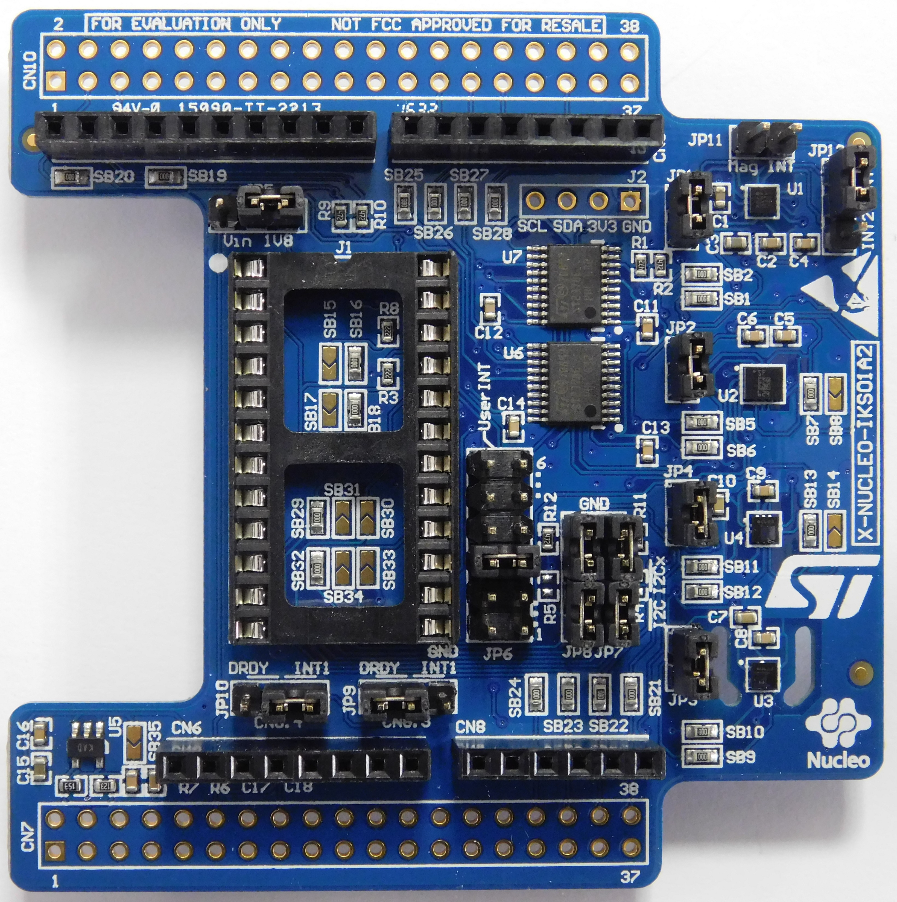
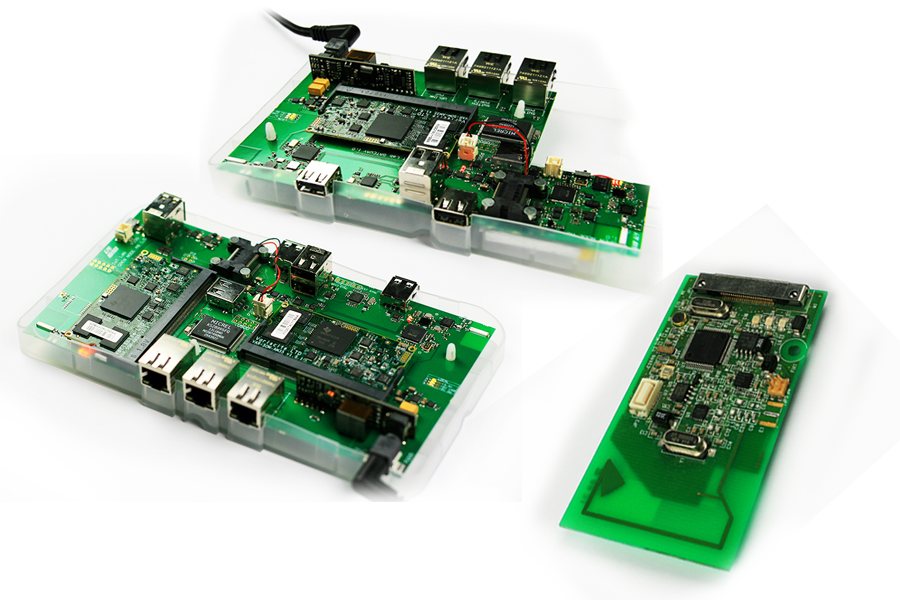

class: center, middle

# RIOT Beginner Tutorial

## Summit 2018

---

## Objective of the tutorial

1. Learn how to write and build a RIOT application

  .right[
      
  ]

--

2. Use IoT-LAB for testing a RIOT application remotely on real hardware

  .right[
      
  ]

--

3. Learn the basics of LoRaWAN networks

  .right[
      
  ]

--

4. Write a LoRaWAN application based on RIOT and TheThingsNetwork provider

  .right[
      
  ]

--

5. Publish sensor data to a Web dashboard

---

## Tutorial organization

- Use the preconfigured VM for building applications

- Run the RIOT applications on [IoT-LAB](https://www.iot-lab.info) testbed

- Hardware used:

  - [ST B-L072Z-LRWAN1](https://www.st.com/en/evaluation-tools/b-l072z-lrwan1.html): STM32L0 + LoRa radio

  .center[
      
  ]

  - [ST X-NUCLEO-IKS01A2](https://www.st.com/en/ecosystems/x-nucleo-iks01a2.html): extension shield with sensors

  .center[
      
  ]

---

## About the VM

- The RIOT course is located in `~/riot-course`

- All required developpement tools are already installed:

  - The GNU ARM Embedded 7.3 toolchain is installed

  - The IoT-LAB cli-tools are installed

  - A list of common editors: Vim, Emacs, VSCode

- Compatible with VirtualBox 5.2 or VMWare Player

- Download it from [here](https://filesender.renater.fr/?s=download&token=de9df807-8e44-bec3-0ba8-7c74ac7c8aee)
  and import it in VirtualBox/VMWare

---

## About IoT-LAB

.center[<a href=https://www.iot-lab.info>https://www.iot-lab.info</a><br><br>
IoT-LAB is a large scale experimentation testbed]

  - Can be used for testing wireless communication networks on small devices

  - Can be used for learning IoT programming and communication protocols

  - Can be used for testing software platforms

.center[
      &nbsp;
      
  ]

---

## IoT-LAB in short

- **2071** programmable nodes, 4 architectures
  <br> &#x21d2; Cortex-M, MSP430, Cortex-A8, AVR

--

- Heterogeneous platforms
  <br> &#x21d2; iotlab-m3, iotlab-a8, Atmel SAMR21-Xpro, Arduino Zero, ST B-L072Z-LRWAN1, Zolertia Firefly

--

- Heterogeneous radios &#x21d2; 802.15.4, 802.15.4g, LoRa, BLE (soon)

--

- Start learning IoT with IoT-LAB at <a href=https://www.iot-lab.info/tutorials/>https://www.iot-lab.info/tutorials/</a>

--

- IoT-LAB principle

.center[
      
  ]

---

## Tutorial summary


---

## Setup your IoT-LAB access in the VM (1)

1. Start the VM and open a command window

2. Grab one paper with the account credentials (user is riotsummit*X*)

3. Register your IoT-LAB credentials
   ```
   $ iotlab-auth -u riotsummitX
   ```
4. Start an experiment with one ST node on Saclay site:
   ```
   $ iotlab-experiment submit -n riotsummit -d 300 -l 1,archi=st-lrwan1:sx1276+site=saclay
   Using custom api_url: https://www.iot-lab.info/rest/
   {
      "id": 133XXX
   }
   ```
   The experiment will book one node during 300 minutes on Saclay site

5. Wait for the experiment to be in "Running" state:
  ```
  $ iotlab-experiment wait -i 133XXX
  "Running"
  ```
---

## Setup your IoT-LAB access in the VM (2)

- Check the name of iotlab node associated to the experiment:
  ```
  $ iotlab-experiment get -i 133XXX -r
  {
      "items": [
          {
              "archi": "st-lrwan1:sx1276",
              "mobile": "0",
              "mobility_type": " ",
              "network_address": "st-lrwan1-10.saclay.iot-lab.info",
              "site": "saclay",
              "state": "Alive",
              "uid": " ",
              "x": "5",
              "y": "67.3",
              "z": "4"
          }
      ]
  }
  ```

&#x21d2; **st-lrwan1-10.saclay.iot-lab.info** is the node that you will work with
on IoT-LAB during the tutorial.

---

## Let's get started

.center[Follow the
[getting-started]([Getting started](https://aabadie.github.io/riot-course/slides/02-getting-started)
instructions]
