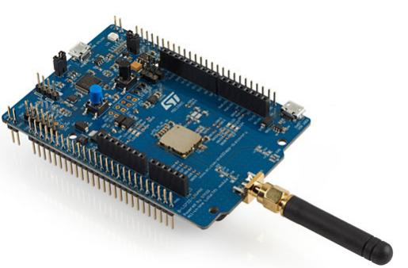
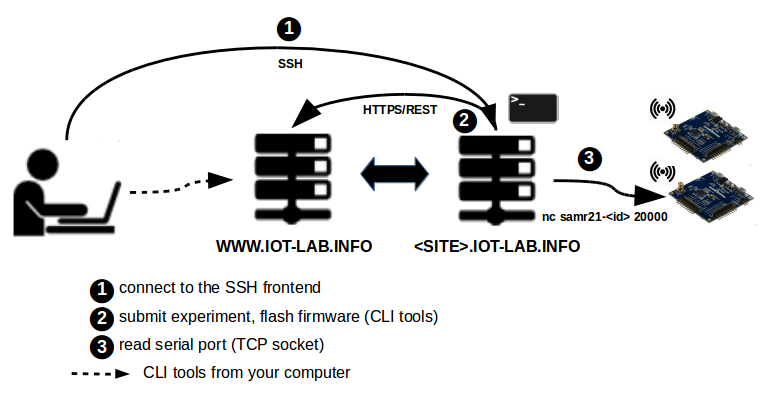

class: center, middle

# RIOT Beginner Tutorial

## RIOT Summit

<a href=https://github.com/riot-os/riot-course>https://github.com/riot-os/riot-course</a>

---

## Objective of the tutorial

1. Learn how to write and build a RIOT application

  .right[
      
  ]

--

2. Use IoT-LAB for testing a RIOT application remotely on real hardware

  .right[
      
  ]

--

3. Learn the basics of LoRaWAN networks

  .right[
      
  ]

--

4. Write a LoRaWAN application based on RIOT and TheThingsNetwork provider

  .right[
      
  ]

--

5. Publish sensor data to a Web dashboard

---

## Tutorial overview (1)

.center[
    
]

---

## Tutorial overview (2)

- No setup required, all activities are performed online in Jupyter Notebooks

.center[
    
]

- Run the RIOT applications on the [IoT-LAB](https://www.iot-lab.info) testbed

- Hardware used:

  - [ST B-L072Z-LRWAN1](https://www.st.com/en/evaluation-tools/b-l072z-lrwan1.html): STM32L0 + LoRa radio

  .center[
      
  ]

  - [ST X-NUCLEO-IKS01A2](https://www.st.com/en/ecosystems/x-nucleo-iks01a2.html): extension shield with sensors

  .center[
      
  ]

---

## About the Jupyter Notebooks

.center[
Available at **https://labs.iot-lab.info**

**Short demo: discover Jupyterlab notebooks!**
<form class=notebook>
    <input class=login id="login_start" type="text" oninput="check_login('login_start', 'launcher_start')" placeholder="Enter your IoT-LAB login">
    <input class=launcher id="launcher_start" type="button" value="Launch notebook" onclick="open_notebook('login_start', 'start.ipynb')" disabled>
</form>
]

---

## IoT-LAB in short

- **2071** programmable nodes, 4 architectures
    &#x21d2; Cortex-M, MSP430, Cortex-A8, AVR

--

- Heterogeneous platforms
    &#x21d2; iotlab-m3, iotlab-a8, Atmel SAMR21-Xpro, Arduino Zero,
  ST B-L072Z-LRWAN1, Zolertia Firefly, nRF52DK, nRF52840DK, Pycom (Micropython)

--

- Heterogeneous radios &#x21d2; 802.15.4, 802.15.4g, LoRa, BLE

--

- IoT-LAB principle

.center[
      
  ]

--

- Start learning IoT with IoT-LAB at
  <a href=https://www.iot-lab.info/tutorials/>https://www.iot-lab.info/learn/</a>

---

## About IoT-LAB

.center[<a href=https://www.iot-lab.info>https://www.iot-lab.info</a>  
IoT-LAB is a large scale experimentation testbed]

  - Can be used for testing wireless communication networks on small devices

  - Can be used for learning IoT programming and communication protocols

  - Can be used for testing software platforms

.center[
      &nbsp;
      
  ]

---

## Let's get started

     

.center[Follow the [getting-started](https://riot-os.github.io/riot-course/slides/02-getting-started) instructions]

---

## LoRaWAN

     

.center[Follow the [lorawan-with-riot](https://riot-os.github.io/riot-course/slides/05-lorawan-with-riot) instructions]
