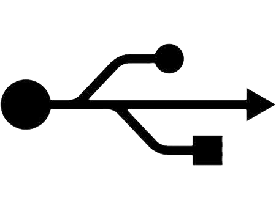
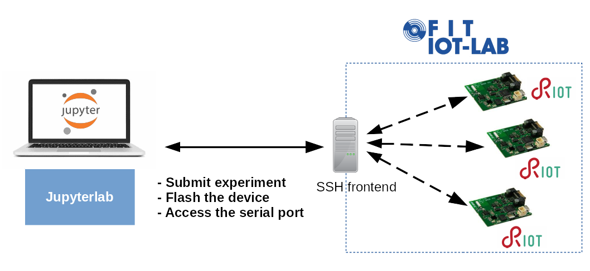

class: center, middle

## Microcontroller based IoT

# RIOT Tutorial

### RIOT Summit

<br/><br/><br/>

.right[.footer[
  Francisco Molina - francois-xavier.molina@inria.fr
  Emmanuel Baccelli - emmanuel.baccelli@inria.fr<br/>
  Alexandre Abadie - alexandre.abadie@inria.fr<br/>
]]

---

## Goals of this Tutorial

<br>

- Learn how to write and build a RIOT application

<br>

- Get a grasp RIOT's core system libraries and building blocks

<br>

- Basics of networking in RIOT

<br>

- Use IoT-LAB for testing a RIOT application remotely on real hardware


---

## Agenda

1. Introduction to RIOT

1. Course Tooling

1. RIOT basics

1. Basics of Networking in RIOT

---

class: center, middle

# Introduction

<br>
<br>
.center[

]

---

class: center, middle


## RIOT Overview

---

## What is RIOT


- **operating system** for microcontrollers

 - **microkernel architecture** &#x21d2; require very low resources
 - **real-time** and **multi-threaded**
 - comes with **in-house networking stacks**
<br><br>

- **open-source**: <a href="https://github.com/RIOT-OS/RIOT">https://github.com/RIOT-OS/RIOT</a>

 - free software platform
 - **world-wide community** of developers


<br>

- **easy to use** and __reuse__

 - Standard programming in C
 - Standard tooling
 - **API is independent** from the hardware


<br><br>

---

## RIOT in the IoT realm

.center[
<br/><br/>
&#x21d2; **RIOT is designed for low-end devices**
]

---

## General-Purpose OS for IoT

- **Real-Time** scheduler
  - &#x21d2; fixed priorities preemption with O(1) operations
  - &#x21d2; tickless scheduler, i.e. no periodic timer event
<br><br>

- **Multi-Threading** and IPC:
  - Separate thread contexts with separate <br>thread memory stack
  - Minimal thread control block (TCB)
  - Thread synchronization using mutexes, <br>semaphores and messaging
  - ISR context handles external events<br>and notifies threads using IPC messages
  <br><br>
  - _Note:_ optional multi-threading


---

## A modular OS

Features are provided as modules &#x21d2; **only build what's required**

- System libraries: **xtimer**, **shell**, crypto, etc

- Sensors and actuators

- Display drivers, filesystems, etc

- Embedded interpretors: Javascript, LUA, uPython

- High-level network protocols: CoAP, MQTT-SN, etc

- External packages: lwIP, Openthread, u8g2, loramac, etc

.center[

]

---

## Hardware support overview

- **Hardware abstraction layer:** support for 8/16/32 bit, ARM, AVR, MIPS

- Supported vendors: Microchip, NXP, STMicroelectronics, Nordic, TI, ESP, RISC-V, etc

- **Large list of sensors and actuators** supported (e.g drivers)

- _native_ board: **run RIOT as process on your computer**

- **+100 boards supported**

.center[
    
]

---

## Useful system libraries

- **xtimer**/**ztimer**

  - high-level timer subsystem that provides full abstraction from the hardware timer

  - Can set callbacks, put a thread to sleep, etc

- **shell**

  - provides interactive command line interface

  - useful for interactive debugging or examples

- **Others:** crypto, fmt, math, etc

---

## External packages

- RIOT can be extended with external packages

- Integrated (and eventually patched) on-the-fly while building an application

- Easy to add: just requires 2 `Makefiles`

- Example of packages: lwIP, Openthread, lvgl, loramac, NimBLE, etc

<br><br>

.center[
    
]

---

## Network stacks

**IP oriented stacks** &#x21d2; designed for Ethernet, WiFi, 802.15.4 networks

- **GNRC**: the in-house 802.15.4/6LowPAN/IPv6 stack of RIOT

--

- **Thread**: 802.15.4 IPv6 stack provided by the ThreadGroup

.center[
    
]

--

- **lwIP**: full-featured network stack designed for low memory consumption

--

- **OpenWSN** (experimental): a deterministic MAC layer implementing the <br/>IEEE 802.15.4e TSCH protocol

.center[
    
]

---

## Other network support

- In-house Controller Area Network (**CAN**)

<br><br>

--

- **BLE** stack support: <a href="https://github.com/apache/mynewt-nimble">NimBLE</a>

<br><br>

--

- **LoRaWAN** stack
&#x21d2; Compliant with LoRaWAN 1.0.2

<br><br>

--

- **SigFox** support for ATA8520e modules


- **UWB (Ultra Wide bBand) & TWR (Two Way Ranging)**

---

## Other important features

- Full featured USB stack (CDC-ACM, CDC-ECM, etc)



<br><br>

--

- Standard and secure software update implementation

.center[https://datatracker.ietf.org/wg/suit/about/]

<br>

---

## Learn RIOT

- RIOT Tutorials

.center[<a href="https://github.com/RIOT-OS/Tutorials">https://github.com/RIOT-OS/Tutorials</a>]

<br>

- RIOT online course

.center[<a href="https://github.com/riot-os/riot-course">https://github.com/riot-os/riot-course</a>]

<br>

- FUN Mooc IoT

.center[<a href="https://www.fun-mooc.fr/courses/course-v1:inria+41020+session02/about">https://www.fun-mooc.fr/courses/course-v1:inria+41020+session02/about</a>]


---

class: center, middle

# Hands-on time!

---

## Tutorial Tooling (1)

1. Embedded software: we use the RIOT code base + ecosystem

--

2. Embedded hardware: we use the open-access testbed IoT-LAB to run RIOT code remotely on micro-controllers

.center[
    
]

---

## Tutorial Tooling (2)

- No setup required, all activities are performed online in Jupyter Notebooks

.center[
    
]

- Run the RIOT applications on the [IoT-LAB](https://www.iot-lab.info) testbed

- Use [IoT-LAB M3](https://www.iot-lab.info/docs/boards/iot-lab-m3/) boards:

<br/>
.center[
    
]

---

## About the Jupyter Notebooks

.center[
Available at **https://labs.iot-lab.info**


**Short demo: discover Jupyterlab notebooks!**
<form class=notebook>
    <input class=login id="login_start" type="text" oninput="check_login('login_start', 'launcher_start')" placeholder="Enter your IoT-LAB login">
    <input class=launcher id="launcher_start" type="button" value="Launch notebook" onclick="open_notebook('login_start', 'start.ipynb')" disabled>
</form>
]

---

## About the Workflow

- for each exercise you will manipulate, compile and run C code extending the RIOT code base, via a Jupyter notebook

- for each exercise, we will follow our typical 2-step process:

1. build for the 'native' target, to run RIOT in a Linux process, typically used for debugging purposes;
2. build for the microcontroller target, and run RIOT on an IoT device accessed via the testbed.

---

class: center, middle

## Getting started

---

## Structure of a RIOT application

A minimal RIOT application consists in:

- A `Makefile`

```mk
APPLICATION = example

BOARD ?= native

RIOTBASE ?= $(CURDIR)/../../../RIOT

DEVELHELP ?= 1

include $(RIOTBASE)/Makefile.include
```

- A C-file containing the main function

```c
#include <stdio.h>

int main(void)
{
    puts("My first RIOT application");
    return 0;
}
```

---

## Build a RIOT application

- The build system of RIOT is based on **make** build tool

--

- To build an application, **make** can be called in 2 ways:

  - From the application directory:
  ```sh
  $ cd <application_directory>
  $ make
  ```

  - From anywhere, by using the `-C` to specify the application directory:
  ```sh
  $ make -C <application_directory>
  ```

--

- Use the **BOARD** variable to specify the target at build time
```sh
$ make BOARD=<target> -C <application_directory>
```
`BOARD` can be any board supported by RIOT<br>
&#x21d2; see the **RIOT/boards** directory for the complete list

--

- Use the **RIOTBASE** variable to specify the RIOT source base directory

---

## Run a RIOT application

This depends on the target board:

- Running on **native**: the RIOT application executed is a simple Linux process
```sh
$ make BOARD=native -C <application_dir>
$ <application_dir>/bin/native/application.elf
```

- Running on **hardware**: the RIOT application must be *flashed* first on the
  board

--

&#x21d2; use the **flash** and **term** targets with make
  - **flash**: build and write the firmware on the MCU flash memory

  - **term**: opens a terminal client connected to the serial port of the
    target

All this can be done in one command:

```sh
$ make BOARD=<target> -C <application_dir> flash term
```

*Note:* the last command can also be used with **native** target

---

## Exercise: your first RIOT application

Let's build and run our first RIOT application !<br><br>

In jupyterlab, open the notebook **riot/basics/hello-world/hello-world.ipynb**
and follow the instructions.

.center[
<form class=notebook>
    <input class=login id="login_hello" type="text" oninput="check_login('login_hello', 'launcher_hello')" placeholder="Enter your IoT-LAB login">
    <input class=launcher id="launcher_hello" type="button" value="Launch notebook" onclick="open_notebook('login_hello', 'riot/basics/hello-world/hello-world.ipynb')" disabled>
</form>
]

---

## How to extend the application

&#x21d2; by adding modules in the application `Makefile` or from the command line:

- Add extra modules with **USEMODULE**<br>
    &#x21d2; `xtimer`, `fmt`, `shell`, `ps`, etc

- Include external packages with **USEPKG**<br>
    &#x21d2; `lwip`, `semtech-loramac`, etc

- Use MCU peripherals drivers with **FEATURES_REQUIRED**:<br>
    &#x21d2; `periph_gpio`, `periph_uart`, `periph_spi`, `periph_i2c`

--

Example in a `Makefile`:
```mk
USEMODULE += xtimer
USEMODULE += shell

USEPKG += semtech-loramac

FEATURES_REQUIRED += periph_gpio
```
Example from the command line:
```sh
$ USEMODULE=xtimer make BOARD=b-l072z-lrwan1
```

---

## Exercise: write an application with a shell

Follow the instructions in the notebook **riot/basics/shell/shell.ipynb**

.center[
<form class=notebook>
    <input class=login id="login_shell" type="text" oninput="check_login('login_shell', 'launcher_shell')" placeholder="Enter your IoT-LAB login">
    <input class=launcher id="launcher_shell" type="button" value="Launch notebook" onclick="open_notebook('login_shell', 'riot/basics/shell/shell.ipynb')" disabled>
</form>
]

---

class: center, middle

[Next: RIOT Basics](https://riot-os.github.io/riot-course/slides/03-riot-basics/#1)
