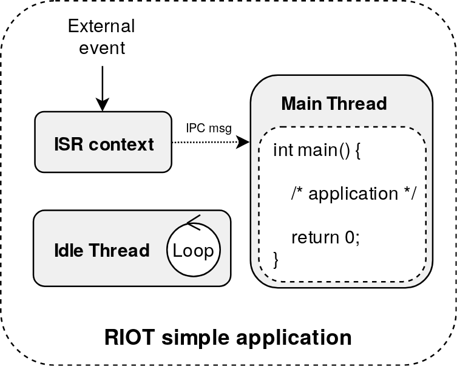
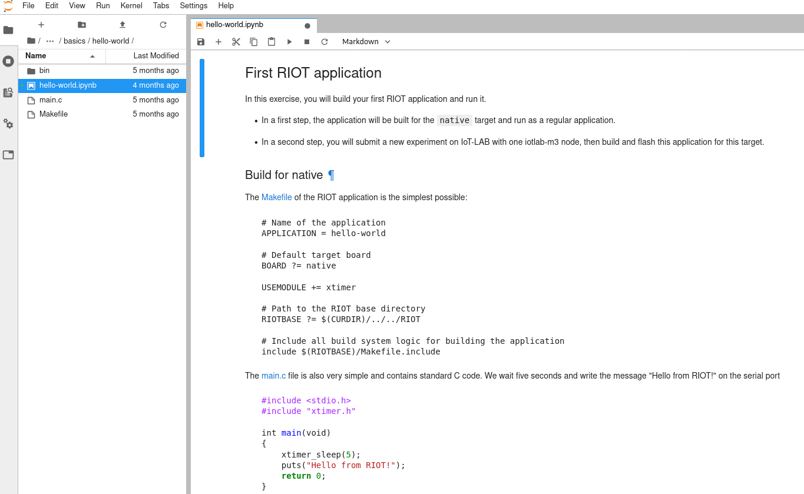

class: center, middle

# RIOT Tutorial

## IoT Security with Microcontrollers

<a href=https://github.com/riot-os/riot-course>https://github.com/riot-os/riot-course</a>

---

## Agenda

1. _**Goals of Tutorial**_

2. Tutorial Tooling

3. A Quick Overview of RIOT

4. First Steps Hands-On with RIOT

5. IoT Security Hands-On

---

## Goals of the Tutorial (1)

1. Learn how to write and build a RIOT application

  .right[
      
  ]

--


2. Some basics of security on IoT devices based on micro-controllers

  .right[
      
  ]

--

3. Hands-on activities: building blocks for secure IoT firmware update over the network

---

## Goals of the Tutorial (2)

1. Exercise 1: compute hashes using SHA256 and SHA3-256

--

2. Exercise 2: sign and verify signature using ed25519

--

3. Exercise 3: encrypt and decrypt a message using AES128 (CTR Mode)

--

4. Exercise 4: secure communication using DTLS 1.2 over IPv6 and 6LoWPAN

--

5. Exercise 5: secure firmware update over the network with SUIT and CoAP

---

## Agenda

1. Goals of Tutorial

2. _**Tutorial Tooling**_

3. A Quick Overview of RIOT

4. First Steps Hands-On with RIOT

5. IoT Security Hands-On

---

## Tutorial Tooling (1)

1. Embedded software: we use the RIOT code base + ecosystem

--

2. Embedded hardware: we use the open-access testbed IoT-LAB to run RIOT code remotely on micro-controllers

.center[
    
]

---

## Tutorial Tooling (2)

- No setup required, all activities are performed online in Jupyter Notebooks

.center[
    
]

- Run the RIOT applications on the [IoT-LAB](https://www.iot-lab.info) testbed

- Use [IoT-LAB M3](https://www.iot-lab.info/docs/boards/iot-lab-m3/) boards:

<br/>
.center[
    
]

---

## About IoT-LAB

.center[<a href=https://www.iot-lab.info>https://www.iot-lab.info</a><br><br>
IoT-LAB is a large scale experimentation testbed]

  - Can be used for testing wireless communication networks on small devices

  - Can be used for learning IoT programming and communication protocols

  - Can be used for testing software platforms

.center[
      &nbsp;
      
  ]

---

## About the Jupyter Notebooks

- Available at https://labs.iot-lab.info

.center[
      
]

- No setup required!

- Source code of the notebooks is available at <br/>
    &nbsp;&nbsp;&nbsp;&nbsp;
    [https://github.com/iot-lab/iot-lab-training](https://github.com/iot-lab/iot-lab-training)

.center[
  **Short demo: in Jupyterlab, read the notebook **start.ipynb**
]

---

## About the Workflow

- for each exercise you will manipulate, compile and run C code extending the RIOT code base, via a Jupyter notebook

- for each exercise, we will follow our typical 2-step process:

1. build for the 'native' target, to run RIOT in a Linux process, typically used for debugging purposes;
2. build for the microcontroller target, and run RIOT on an IoT device accessed via the testbed.

---

## Agenda

1. Goals of Tutorial

2. Tutorial Tooling

3. _**A Quick Overview of RIOT**_

4. First Steps Hands-On with RIOT

5. IoT Security Hands-On

---

class: center, middle

## RIOT Overview

---

## What is RIOT


- **operating system** for microcontrollers

 - **microkernel architecture** &#x21d2; require very low resources
 - **real-time** and **multi-threaded**
 - comes with **in-house networking stacks**
<br><br>

- **open-source**: <a href="https://github.com/RIOT-OS/RIOT">https://github.com/RIOT-OS/RIOT</a>

 - free software platform
 - **world-wide community** of developers


<br>

- **easy to use** and __reuse__

 - Standard programming in C
 - Standard tooling
 - **API is independent** from the hardware


<br><br>

---

## General-Purpose OS for IoT

- **Real-Time** scheduler
  - &#x21d2; fixed priorities preemption with O(1) operations
  - &#x21d2; tickless scheduler, i.e. no periodic timer event
<br><br>

- **Multi-Threading** and IPC:
  - Separate thread contexts with separate <br>thread memory stack
  - Minimal thread control block (TCB)
  - Thread synchronization using mutexes, <br>semaphores and messaging
  - ISR context handles external events<br>and notifies threads using IPC messages
  <br><br>
  - _Note:_ optional multi-threading



---

## A modular OS

Features are provided as modules &#x21d2; **only build what's required**

- System libraries: **xtimer**, **shell**, crypto, etc

- Sensors and actuators

- Display drivers, filesystems, etc

- Embedded interpretors: Javascript, LUA, uPython

- High-level network protocols: CoAP, MQTT-SN, etc

- External packages: lwIP, Openthread, u8g2, loramac, etc

.center[

]

---

## Network stacks

**IP oriented stacks** &#x21d2; designed for Ethernet, WiFi, 802.15.4 networks

- **GNRC**: the in-house 802.15.4/6LowPAN/IPv6 stack of RIOT

--

- **Thread**: 802.15.4 IPv6 stack provided by the ThreadGroup

.center[
    
]

--

- **OpenWSN** : a deterministic MAC layer implementing the <br/>IEEE 802.15.4e TSCH protocol

.center[
    
]

--

- Other IPv6 stacks:

 - **lwIP**: full-featured network stack designed for low memory consumption

 - **emb6**: A fork of Contiki network stack that can be used without proto-threads

---

## Other network support

- In-house Controller Area Network (**CAN**)
<br><br>

--

- **BLE** stack support: <a href="https://github.com/apache/mynewt-nimble">NimBLE</a>

<br><br>

--

- **LoRaWAN** stack
&#x21d2; Compliant with LoRaWAN 1.0.2

<br><br>

--

- **SigFox** support for ATA8520e modules


---

## Other important features

- Full featured USB stack (CDC-ACM, CDC-ECM, etc)


<br><br>

--

- Standard and secure software update implementation

.center[https://datatracker.ietf.org/wg/suit/about/]

<br>

--


---

## Agenda

1. Goals of Tutorial

2. Tutorial Tooling

3. A Quick Overview of RIOT

4. _**First Steps Hands-On with RIOT**_

5. IoT Security Hands-On

---

class: center, middle

## Getting started

---

## Structure of a RIOT application

A minimal RIOT application consists in:

- A `Makefile`

```mk
APPLICATION = example

BOARD ?= native

RIOTBASE ?= $(CURDIR)/../../../RIOT

DEVELHELP ?= 1

include $(RIOTBASE)/Makefile.include
```

- A C-file containing the main function

```c
#include <stdio.h>

int main(void)
{
    puts("My first RIOT application");
    return 0;
}
```

---

## Build a RIOT application

- The build system of RIOT is based on **make** build tool

--

- To build an application, **make** can be called in 2 ways:

  - From the application directory:
  ```sh
  $ cd <application_directory>
  $ make
  ```

  - From anywhere, by using the `-C` to specify the application directory:
  ```sh
  $ make -C <application_directory>
  ```

--

- Use the **BOARD** variable to specify the target at build time
```sh
$ make BOARD=<target> -C <application_directory>
```
`BOARD` can be any board supported by RIOT<br>
&#x21d2; see the **RIOT/boards** directory for the complete list

--

- Use the **RIOTBASE** variable to specify the RIOT source base directory

---

## Run a RIOT application

This depends on the target board:

- Running on **native**: the RIOT application executed is a simple Linux process
```sh
$ make BOARD=native -C <application_dir>
$ <application_dir>/bin/native/application.elf
```

- Running on **hardware**: the RIOT application must be *flashed* first on the
  board

--

&#x21d2; use the **flash** and **term** targets with make
  - **flash**: build and write the firmware on the MCU flash memory

  - **term**: opens a terminal client connected to the serial port of the
    target

All this can be done in one command:

```sh
$ make BOARD=<target> -C <application_dir> flash term
```

*Note:* the last command can also be used with **native** target

---

## Exercise: your first RIOT application

Let's build and run our first RIOT application !<br><br>

In jupyterlab, open the notebook **riot/basics/hello-world/hello-world.ipynb**
and follow the instructions.

.center[
    
]

---

## How to extend the application

&#x21d2; by adding modules in the application `Makefile` or from the command line:

- Add extra modules with **USEMODULE**<br>
    &#x21d2; `xtimer`, `fmt`, `shell`, `ps`, etc

- Include external packages with **USEPKG**<br>
    &#x21d2; `lwip`, `semtech-loramac`, etc

- Use MCU peripherals drivers with **FEATURES_REQUIRED**:<br>
    &#x21d2; `periph_gpio`, `periph_uart`, `periph_spi`, `periph_i2c`

--

Example in a `Makefile`:
```mk
USEMODULE += xtimer shell

USEPKG += semtech-loramac

FEATURES_REQUIRED += periph_gpio
```
Example from the command line:
```sh
$ USEMODULE=xtimer make BOARD=b-l072z-lrwan1
```

---

## Exercise: write an application with a shell

Follow the instructions in the notebook **riot/basics/shell/shell.ipynb**

.center[
    
]

---

## Agenda

1. Goals of Tutorial

2. Tutorial Tooling

3. A Quick Overview of RIOT

4. First Steps Hands-On with RIOT

5. _**IoT Security Hands-On**_

---

class: center, middle

## Security basics for IoT

---

## What Attacks?

To secure IoT devices, one must consider attacks of diverse nature.

.center[
    
]

---

## Security in Practice

IoT security in practice must combine 

- several defense mechanisms, 
- working at different levels of the system, and 
- protecting against different types of attacks. 

Each of these defense mechanisms is necessary, but not sufficient to achieve security overall.

Next, we focus on mechanisms applicable on low-end IoT devices to:

- defend against network attacks, and
- defend against some software attacks based on remote malware installation.

---

## Crypto Primitives for IoT Security (1)

Appropriate primitives for basic guarantees on digital data in IoT?

- **Authenticity**: guarantee on the origin of the data;
- **Integrity**: guarantee that original data has not been tampered with;
- **Confidentiality**: guarantee that data is intelligible only for intended recipients.

---

## Crypto Primitives for IoT Security (2)

Typical building blocks are:

- **Hash**: function mapping data of arbitrary size to (smaller) fixed-size values;
- **Encryption**: set of algorithms enabling the originator (resp. recipient) of digital data to encode (resp. decypher) this data using one or more keys.
- **Digital Signature**: set of algorithms enabling (private/public) key generation, signature generation based on private key and authenticity verification based on public key.


---

## Exercise: Compute a Hash with SHA-256 and SHA3-256

Follow the instructions in the notebook **riot/security/hash/hash.ipynb**

---

## Exercise: Sign / Verify a Digital Signature with ed25519

Follow the instructions in the notebook **riot/security/signature/signature.ipynb**

---

## Exercise: Encrypt / Decrypt a Message using AES128 (CTR Mode)

Follow the instructions in the notebook **riot/security/encyption/encyption.ipynb**

---

## Network Protocols for IoT Security (1)

Generic protocols for low-power IoT networks?

- wide variety low-power comunication technologies (BLE, Zigbee, LoRa, SigFox... and some wired alternatives too)
- IP protocols have been adapted to work over these

.center[
    
]

---

## Network Protocols for IoT Security (2)

Generic security protocols for low-power IoT networks?


.center[
    
]
---

## Exercise: Secure Communication using DTLS over IPv6 and 6LoWPAN

Follow the instructions in the notebook **riot/security/dtls/dtls.ipynb**

---

## Securing IoT Software (1)

What Internet-age software has taught us:

- you can’t secure what you can’t update!
- software updates are an attack vector!

=> **Enabling (legitimate) software updates is crucial and difficult**

---
## Securing IoT Software (2)

SUIT standard work-in progress at IETF draft-ietf-suit-manifest-09

.center[
    
]

---
## SUIT Workflow


.center[
    
]

---

## Exercise: Secure IoT Firmware Update using SUIT and CoAP

Follow the instructions in the notebook **riot/security/ota/ota.ipynb**

---

class: center, middle

## All complete ? Well done!
