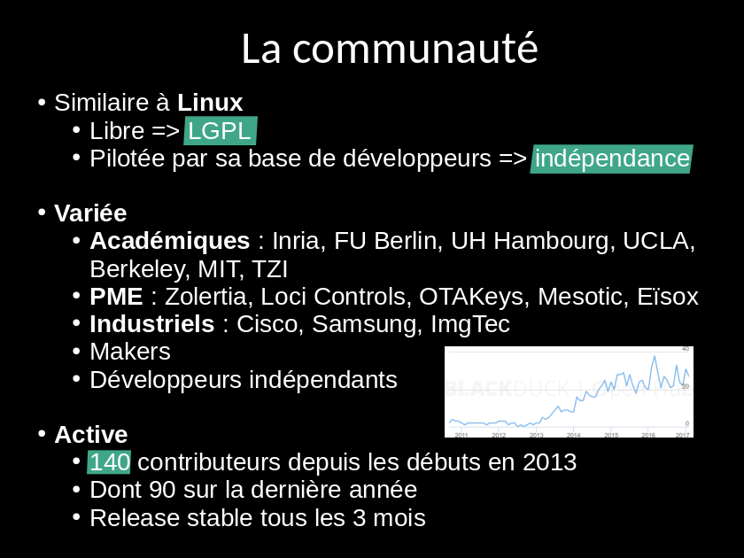

class: center, middle

<br/><br/><br/><br/><br/><br/>

# RIOT Workshop

### Hands-on tutorial

<br/><br/><br/><br/>

.footnote[
Alexandre Abadie, Inria
]

---

## Day one

1. Introduction

    - General information
    - Technical overview

2. Getting started with RIOT

    - Setup your environment
    - Build your first application
    - Using the native target
    - Debug your application

3. RIOT internals

    - Structure and organization of the operating system
    - Main modules of RIOT
    - Hardware abstraction layer and drivers
    - External packages

---

## Day two

1. Networking with RIOT

    - An overview of available stacks

    - GNRC: Generic Network Stack

    - Practicing on IoT-LAB

2. Using LoRaWAN with RIOT

    - An overview of LoRaWAN

    - Using RIOT with TheThingsNetwork

    - Building a LoRa device application with RIOT

---

## About me

<br/><br/>

- Research engineer at Inria in Saclay

- 10 years of experience in medical imaging

- Since 2015, open source contributor in Python and IoT projects

- RIOT maintainer since 2016

- FIT/IoT-LAB team member (https://www.iot-lab.info)

<br/><br/>

.center[]

---

class: center, middle

# Introduction

---

## What is RIOT

<br><br>

RIOT is

- a real-time multithreaded operating system

- built with in-house networking capababilities

- designed for microcontroller based devices

- open-source: https://github.com/RIOT-OS/RIOT

<br><br>

.center[
    
]

---

## RIOT in the IoT world

.center[
<br/><br/>
<br/><br/>
&#x21d2; RIOT is designed for low-end devices
<br>(kB RAM, MHz, mW)
]

---

## History of the project

- 2008: Firekernel, micro-kernel for wireless sensor networks

- 2013: Inria & FU Berlin funded RIOT

- The community today:

  - Almost 180 contributors since the beginning

  - Academics: Inria, FU Berlin, HAW Hamburg, Berkeley, UCLA, MIT, TZI

  - Industrial: Thalès, Cisco, Samsung, ImgTec

  - SME: Zolertia, OTAKeys, Mesotic, Eisoc, We-sens

- Annual RIOT Summit: https://summit.riot-os.org

.right[

]

---

## The RIOT philosophy & community

- RIOT is free-software, licensed under LGPLv2.1

- The community takes inspiration from Linux

.right[
    
]

- Use standards whenever possible <br>
  (C-ANSI, standard tools, standard protocols, standard procedures)

- Follow POSIX standards

- Avoid code duplication, easy to program, increase portability, modularity

- Vendor & Technology independence

- Decisions and orientations are taken by a grass-root community

.center[
    
]

---

## Competitors

.center[
    
]
<div style="position: absolute;right: 100px;">
<span style="font-style: italic;font-size:12px;text-align:right">
Reference: O. Hahm et al. "Operating Systems for Low-End Devices<br>
in the Internet of Things: A survey," IEEE Internet of ThingsJournal, 2016.
</span>
</div>
<br>
<br>

- TinyOS: less active

- FreeRTOS: widely used RTOS

- Contiki: philosophy most similar to RIOT

- Zephyr: very active and sponsored by Intel

- Mbed OS: very active and sponsored by ARM

---

## Who is using RIOT

**IoT solutions deployments**

- LoRa devices in a Copper mine with Telephonica (Chile)<br>
http://summit.riot-os.org/2017/blog/2017/10/06/slides/

- Automatic cereal dispenser with Almagro (Chile)<br>
https://www.indiegogo.com/projects/the-venture-algramo-chile#/

- Fujitsu: IoT modules orchestration<br>
http://riot-os.org/files/RIOT-Summit-2017-slides/4-3-Virtualization-Session-Fujitsu.pdf

- Cisco, Huawei: experimental deployment using ICN-IoT

**IoT products**

- OTAKeys (Continental): On-Board diagnostics for connected cars

- Hamilton IoT (USA), Unwired devices (Russia)

- we-sens.com, mesotic

- Eistec: http://www.eistec.se/projects/

- Sleeping Beauty:  GPS tracking device with an integrated GSM modem

---

class: center, middle

# Technical overview

<br/>
Long story short:<br/>
http://riot-os.org/files/2018-IEEE-IoT-Journal-RIOT-Paper.pdf

---

## OS characteristics

- Micro-kernel based architecture: modular approach

.center[
    
]

- Multi-Threading and IPC:
  - Separate thread contexts with separate thread memory stack
  - Minimal thread control block (TCB)
  - Thread synchronization using mutexes, semaphores and messaging

- Real-Time scheduler
  - &#x21d2; fixed priorities preemption with O(1) operations
  - &#x21d2; tickless scheduler

- Small footprint &#x21d2; 2.8kB RAM, 3.2kB ROM on 32-bit Cortex-M

---

## Scheduler & Multi-Threading

2 threads by default:

- the `main` thread: running the `main` function

- the `idle` thread:

  - lowest priority <br>&#x21d2; fallback thread when all other threads are blocked or terminated
  - switches the system to low-power mode

The ISR context handles external events and notifies threads using IPC messages

.center[
    
]

---

## Hardware support overview

- Support for 8/16/32 bit, ARM, AVR, MIPS

- `native` board: run RIOT as process on your computer

- Vendors: Microchip, NXP, STMicroelectronics, Nordic, TI, etc

- Large list of sensors and actuators supported (e.g drivers)

- Concept of "board" that simplify ports &#x21d2; +100 boards supported

<br><br>

.center[
    
]

---

## Hardware abstraction layer

- Divided in 3 blocks: boards, cpus, drivers

- CPUs are organized as follows:<br>
**architecture** (ARM) > **family** (stm32) > **type** (stm32l4) > **model** (stm32l476rg)

- Generic API for cpu peripherals (gpio, uart, spi, pwm, etc)

    &#x21d2; same API for all architectures

- Only based on vendor header files (CMSIS) &#x21d2; implementation from scratch

    &#x21d2; less code duplication, more efficient, more work

- One application &#x21d2; one board &#x21d2; one cpu model

.center[
    
]

---

## High-level drivers

- Sensors and actuators

    &#x21d2; temperature, pressure, humidity, IMU, light sensors, radios, sd card, etc

- Memory Techonology Device (MTD) abstraction and filesystems

    &#x21d2; FatFS, LittleFS, SPIFFS

- Display drivers

    &#x21d2; u8g2, ucglib, HD44780

.center[
    
]

---

## System libraries

xtimer

crypto

formatting/encoder/decoder

shell

---

## Network stacks and protocols

3 types of network stacks:

- IP oriented stacks &#x21d2; designed for Ethernet, WiFi, 802.15.4 networks
  - **GNRC**: the in-house 802.15.4/6LowPAN/IPv6 stack of RIOT

  - **Thread**: another 802.15.4 IPv6 stack supported by Nest (Google)
.center[
    
]
  - **lwIP**: full-featured network stack designed for low memory consumption

  - **emb6**: A fork of Contiki network stack that can be used without proto-thread

- In-house Controller Area Network (**CAN**)

- **LoRaWAN** stack: port of Semtech loramac-node reference implementation

.center[
    
]

---

## External packages

- RIOT can be extended with external packages

- Integrated (and eventually patched) on-the-fly while building an application

- Easy to add: just require 2 `Makefiles`

- Example of packages: lwIP, Openthread, u8g2, loramac, etc

<br><br>

.center[
    
]

---

## Ecosystem & community processes

- Tooling and build system

  - hand crafted makefiles for building a RIOT application

  - On-Chip debugging with **OpenOCD** and **GDB**

- Distributed and fast CI, Murdock: https://ci.riot-os.org

    &#x21d2; Build all test/example applications for all targets<br><br>
    &#x21d2; Static tests (Cppcheck, Coccinelle, etc)<br><br>
    &#x21d2; Run on hardware (WIP)

- Online documentation generated with Doxygen

    &#x21d2; https://doc.riot-os.org

- In-depth code reviews

- One release every 3 month: **&lt;year&gt;.&lt;month&gt;** (ex: 2018.01, 2018.04, etc)

---

class: center, middle

# Getting started

---

## Optional prerequisites: setup a local environment

1. Install and setup Git:
```bash
$ sudo apt-get install git
$ git config --global user.name "Your name"
$ git config --global user.email "Your email"
```
2. Get the code:

  - Latest version:
```bash
$ git clone --depth=1 https://github.com/RIOT-OS/RIOT.git
```

  - Latest stable branch:
```bash
$ git clone -b 2018.01-branch https://github.com/RIOT-OS/RIOT.git
```

3. Getting the workshop code:
```
$ git clone https://gitlab.inria.fr/riot-workshop-samples.git
```

---

## Optional prerequisites: setup your build environment

First possibility: install a toolchains and development tools locally:
  - Build essential tools (make, gcc, etc):
```bash
$ sudo apt-get install build-essential g++-multilib
```
  - Install toolchains (ARM):
```bash
$ sudo add-apt-repository ppa:team-gcc-arm-embedded/ppa
$ sudo apt-get update
$ sudo apt-get install gcc-arm-embedded
```
  - Install flasher tools, OpenOCD (version >= 0.10 required)
```bash
$ sudo apt-get install openocd
```
Otherwise, build OpenOCD from sources:<br>https://github.com/RIOT-OS/RIOT/wiki/OpenOCD

---

## Prerequisites: setup your build environment

- Using Docker
```bash
$ docker pull riot/riotbuild
$ cd <application directory>
$ make BUILD_IN_DOCKER=1
```

- Using a VM, with vagrant
```bash
$ vagrant up
$ vagrant ssh
```

- Using the provided VM in virtualbox &#x21d2; **our choice**

  - Toolchains, debugger, flasher tools already installed

  - RIOT code already downloaded

  - Sample applications provided

- More info on the Wiki:

.right[&#x21d2; &nbsp;&nbsp;https://github.com/RIOT-OS/RIOT/wiki/Setup-a-Build-Environment]

---

## Writing your first application

A minimal RIOT application consists in:
- A `Makefile`

```mk
APPLICATION = example

BOARD ?= native  # build a native application of RIOT by default

RIOTBASE ?= $(CURDIR)/../../RIOT

include $(RIOTBASE)/Makefile.include
```

- A C-file containing a main function:

```c
#include <stdio.h>

int main(void)
{
    puts("My first RIOT application");
    return 0;
}
```

---

## Build the application

- Simply run `make` from the application directory:

```sh
$ cd ~/riot-workshop-samples/getting-started
$ make
Building application "example" for "native" with MCU "native".

"make" -C /home/user/RIOT/boards/native
"make" -C /home/user/RIOT/boards/native/drivers
"make" -C /home/user/RIOT/core
"make" -C /home/user/RIOT/cpu/native
"make" -C /home/user/RIOT/cpu/native/periph
"make" -C /home/user/RIOT/cpu/native/vfs
"make" -C /home/user/RIOT/drivers
"make" -C /home/user/RIOT/drivers/periph_common
"make" -C /home/user/RIOT/sys
"make" -C /home/user/RIOT/sys/auto_init
 text   data  bss    dec    hex   filename
 20206  568   47652  68426  10b4a .../getting-started/bin/native/example.elf
```

_Trick:_ use `-C` option with `make`
```
$ cd ~/riot-workshop-samples
$ make -C getting-started
```

## 